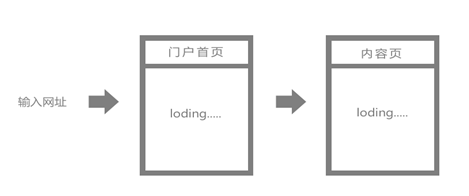
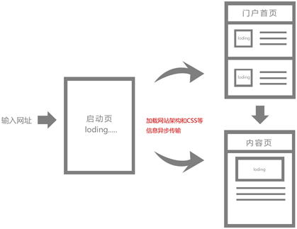
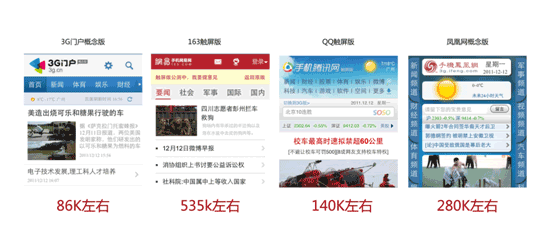
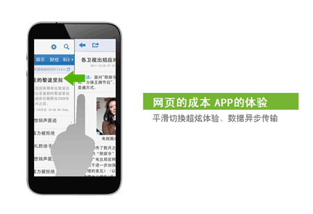
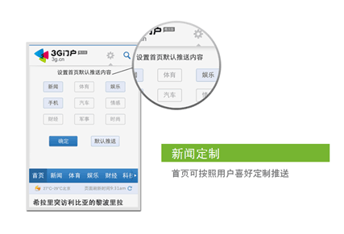
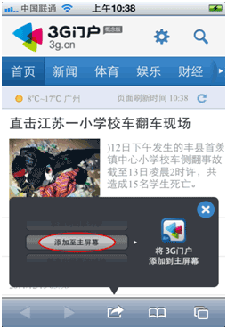

现在手机网站大部分还是沿用传统PC网站模式，无法体现出手机的特性体验也会较差，所以大部分人会选择APP软件浏览资讯，但下载APP、版本更新、流量等成本是用户需要承受的。随着HTML5的技术发展，手机网站已经可以接近APP软件的体验和功能，而且还有独有的优势，3G门户概念版是国内首个基于HTML5技术的综合资讯移动WebAPP网站，未来移动互联网站的趋势 ，（手机输入app.3g.cn）他的特点是速度快、省流量、体验更佳，下面将分析每个功能点。

#### 一、 预存储

传统网站打开每个页面数据需全部重新加载，速度较慢，耗流量，体验较差。

WebAPP模式预先加载固定架构数据，存储本地第二次打开页面无需重复加载，浏览速度更快、更省流量、体验较好。

#### 二、 速度更快 更省流量

我们做了个测试，从上图可以看到各门户网站高端版本首次加载数据的大小，3G门户概念版最小为86K，而且这86K架构数据首次加载后第二次无需重复加载，只需要加载较小的新数据即可。

#### 三、网页的成本 APP的体验

无需下载安装，即可享受APP软件的体验，支持部分手势操作，平滑切换，数据异步传输让你无等待感。(例如打开某一篇文章，会先显示标题和导读，然后再加载详细内容，让你浏览过程不会有等待感，传统网页是需要等所有数据加载完毕才显示)

#### 四、个性定制新闻

用户可以根据自己的喜好定制首页新闻推送，无需注册

#### 五、添加桌面图标

可以通过iphone自带浏览器safari功能添加桌面图标，这样也可以和app一样方便点击打开无需输入网址。

暂时HTML5技术还无法完全实现原生app软件的所有功能，但随着技术的不断发展HTML5会有属于他自己的一片天地。