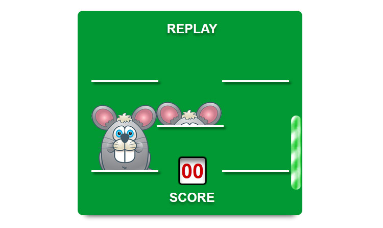
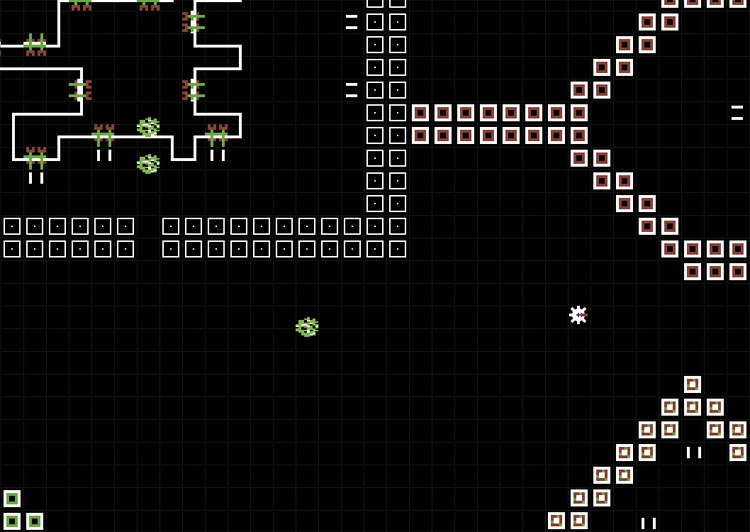
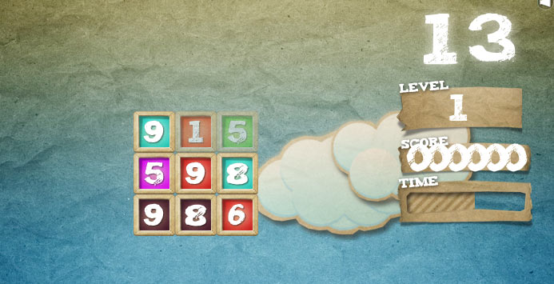
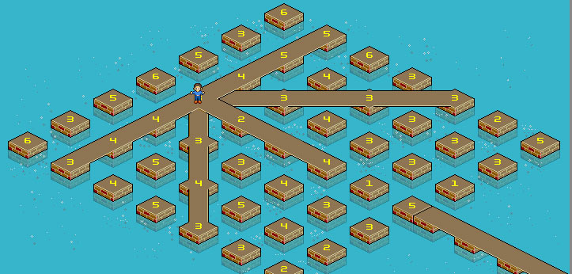
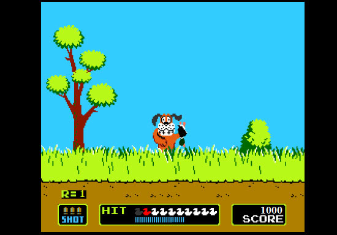
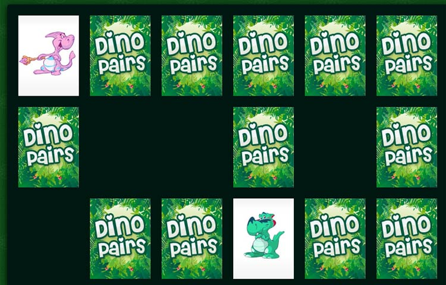
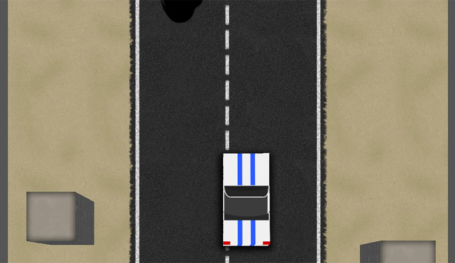
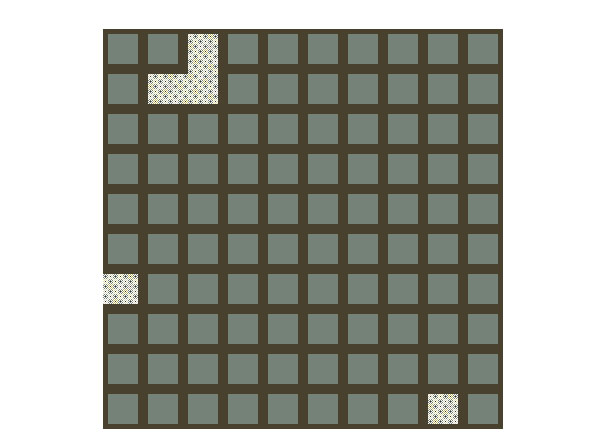
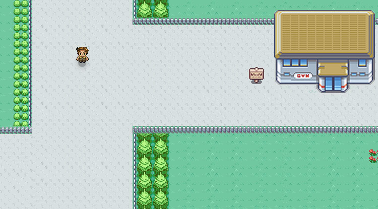
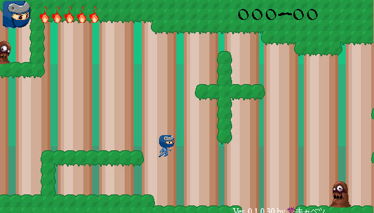

这是一些采用HTML, CSS, 和Javascript开发的游戏。有些甚至只用到了CSS技术。

[1. Whack-a-Rat – CSS only game](http://www.cssplay.co.uk/menu/cssplay-whack-a-rat.html")

[2. SURVIVOR (1982 Commodore 64 game remake)](http://www.schillmania.com/survivor/")

[3. Sumon](http://labs.hyperandroid.com/static/caat/sumon/css/Sumon.html")

[4. 3D – CSS puzzle](http://www.cssplay.co.uk/menu/three_d.html")

[5. Duck Hunt](https://developer.mozilla.org/ru/demos/detail/duck-hunt/launch")

[6. Dino Pairs Game](http://my-html-codes.com/HTML5_tutorials/Dino_pairs2/index.html")

[7. Cops and Robbers – CSS puzzle](http://www.cssplay.co.uk/menu/tilt.html")

[8. Cascading Cube Racer](http://futekov.github.com/Cascading-Cube-Racer/")

[9. CSS maze puzzle](http://www.cssplay.co.uk/menu/maze2.html")

[10. One-Of-A-Kind CSS/JS-Based Game Portfolio](http://danielsternlicht.com/")

[11. Anigma](http://icefox.net/anigma/")

[12. Ninja Jarimaru](http://murakya.net/game/yokoaction_beta/game/index.html")

