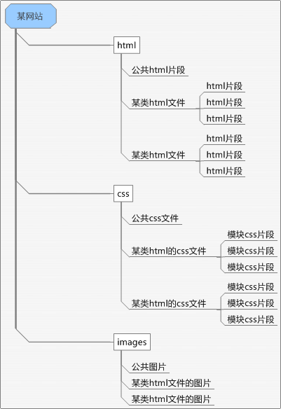

#### 模块化概念

模块化就是为了减少循环依赖，减少耦合，提高设计的效率。为了做到这一点，我们需要有一个设计规则，所有的模块都在这个规则下进行设计。良好的 设计规则，会把耦合密集的设计参数进行归类作为一个模块，并以此划分工作任务。而模块之间彼此通过一个固定的接口（所谓的可见参数）进行交互，除此之外的 内部实现（所谓的隐参数）则由模块的开发团队进行自由发挥。

#### 程序模块化的目的：

> 减少循环依赖  
> 减少耦合  
> 提高设计效率

#### 程序模块化的实施：

> 把耦合密集的归为一个模块  
> 模块间通过固定的接口交互  
> 模块内部实现自由发挥

#### HTML CSS Images的模块化设计

页面模块化的实施，这里指的是针对除去JavaScript部分的页面代码进行模块化实施。通过html css 图片进行模块化。

页面模块化的实施思路是高度耦合的页面片段封装，模块布局作为公开接口，高度耦合的页面进行封装，使用独立的css文件，高度耦合的图片进行封 装，给某类相关性强的图片建立文件夹。

页面模块化的目的是，实现多人协同开发页面，提高页面研发速度和降低维护难度。研发速度的提升体现在多人协同并行开发， 维护难度体现在减少版本的混乱，根据模块区分版本降低版本间代码冲突和文件错误覆盖。

#### 拆分页面模块，从小到大的分解

**1.拆分页面模块**

一个页面有很多个小单元模块组成，他来自有原始需求文档，比如logo，导航，内容1，内容2，内容3，内容4，尾部导 航，版权信息等等。根据他们就可以拆分出基本的模块。

**2.拆分网站模块**

将整个网站安排频道或者分类进行拆分，比如首页，内容页，文字列表页，图片列表页，频道1页面，频道2页面，分类1页面，分类2页面，后台管理 页面，等等。

**3.每个网站作为一个模块。**比如商城站，支付站，论坛，三个站独立为三个大模块。

#### 模块化实现

1.高度耦合提取为一个模块，用模块代码作用域进行控制**

代码1. 非继承模块，通过后代选择符方式控制作用域

	

	<h3 class="title">title</h3>
	

	con
	

	<a class="more">more</a>
	

	.mod {}
	.mod .title {}
	.mod .con {}
	.mod .more {}

	

	<ul>
	<li><a href="" title="">关于</a></li>
	<li><a href="" title="">合作</a></li>
	<li><a href="" title="">招聘</a></li>
	</ul>

	Copyright © 2009 某公司 版权所有
	

	.footer {}
	.footer ul {}
	.footer p {}

代码2. 继承模块，提取众多模块中公共部分，具体模块通过优先级进行处理。继承模块方面整站某些模块的批量修改处理，也提高复用性，降低代码重复。

	.mod {}
	.mod .title {}
	.mod .con {}
	.mod .more {}

	.note {}
	.note .title {}
	.note .con {}
	.note .more {}

	

	<h3 class="title">title</h3>
	

	con
	

	<a class="more">more</a>
	

**2.页面模块**

页面模块代码作用域的控制通过css文件来控制。某类具有高度耦合的页面使用自身的css文件。

**3.模块间的公开接口**

上面是模块的封装，公开的接口在页面中表现为什么？

首先是reset，base，可继承模块，这些代码是开放接口，必须根据这些代码进行页面代码开发，也就是你的页面代码必须在以上代码基础上开 发。

其次是css文件，css文件名称和它作用于那些页面。

再次是布局、模块class，id命名，模块在页面的哪个位置。在CSS中的表现就是定位，布局，和部分盒模型。float、 position、 width、height等等。布局通常使用css作为接口实现，如果布局具有高度的逻辑性，完全可以通过html和css组合进行，比如960 Grid System，或者采用YUI grid.css。模块class和id的命名用于区分模块，不能在一个页面的所有css中出现不同模块同用一个class和id名。

#### 规划整站模块

上文提到的基本的原理，真正实施起来还是存在很多问题，模块粒度问题，公共模块与普通模块的区分，继承模块是否值得继承等等，页面模块如何划 分。

首先，了解你的项目，通过画网站树状图了解你网站的总体结构和页面模块。

其次，理清结构逻辑和视觉逻辑，结构逻辑就是看你的页面由那些模块组成，视觉逻辑了解可继承模块，布局逻辑（网格布局或者非网格布局）

