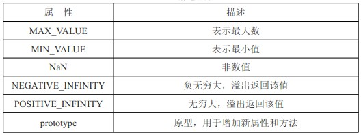
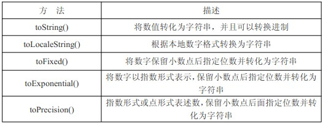
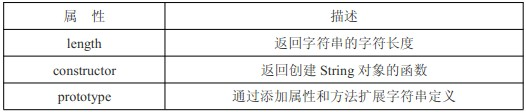
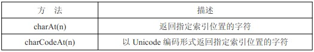
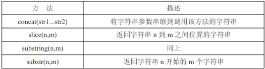
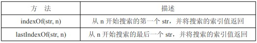
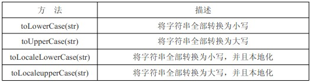
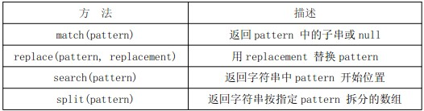
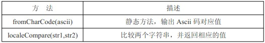
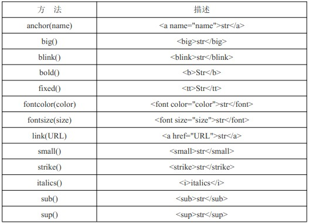

为了便于操作基本类型值，ECMAScript 提供了 3 个特殊的引用类型：Boolean、Number和 String。这些类型与其他引用类型相似，但同时也具有与各自的基本类型相应的特殊行为。实际上，每当读取一个基本类型值的时候，后台就会创建一个对应的基本包装类型的对象，从而能够调用一些方法来操作这些数据。

#### 一．基本包装类型概述

	var box = 'Mr. Lee';//定义一个字符串
	var box2 = box.substring(2);//截掉字符串前两位
	alert(box2);//输出新字符串

变量 box 是一个字符串类型，而 box.substring(2)又说明它是一个对象(PS：只有对象才会调用方法)，最后把处理结果赋值给 box2。'Mr. Lee'是一个字符串类型的值，按道理它不应该是对象，不应该会有自己的方法，比如：

	alert('Mr. Lee'.substring(2));//直接通过值来调用方法

**1.字面量写法：**

	var box = 'Mr. Lee';//字面量
	box.name = 'Lee';//无效属性
	box.age = function () {//无效方法
		return 100;
	};
	alert(box);//Mr. Lee
	alert(box.substring(2));//. Lee
	alert(typeof box);//string
	alert(box.name);//undefined
	alert(box.age());//错误

**2.new 运算符写法：**

	var box = new String('Mr. Lee');//new 运算符
	box.name = 'Lee';//有效属性
	box.age = function () {//有效方法
		return 100;
	};
	alert(box);//Mr. Lee
	alert(box.substring(2));//. Lee
	alert(typeof box);//object
	alert(box.name);//Lee
	alert(box.age());//100

以上字面量声明和 new 运算符声明很好的展示了他们之间的区别。但有一定还是可以肯定的，那就是不管字面量形式还是 new 运算符形式，都可以使用它的内置方法。并且Boolean 和 Number 特性与 String 相同，三种类型可以成为基本包装类型。

PS：在使用 new 运算符创建以上三种类型的对象时，可以给自己添加属性和方法，但我们建议不要这样使用，因为这样会导致根本分不清到底是基本类型值还是引用类型值。

#### 二．Boolean 类型

Boolean 类型没有特定的属性或者方法。

#### 三．Number 类型

Number 类型有一些静态属性(直接通过 Number 调用的属性，而无须 new 运算符)和方法。

**Number 静态属性**

**Number 对象的方法**

	var box = 1000.789;
	alert(box.toString());//转换为字符串，传参可以转换进制
	alert(box.toLocaleString());//本地形式，1,000.789
	alert(box.toFixed(2));//小数点保留，1000.78
	alert(box.toExponential());//指数形式，传参会保留小数点
	alert(box.toPrecision(3));//指数或点形式，传参保留小数点

#### 四．String 类型

String 类型包含了三个属性和大量的可用内置方法。

**String 对象属性**

String 也包含对象的通用方法，比如 valueOf()、toLocaleString()和 toString()方法，但这些方法都返回字符串的基本值。

**字符方法**

	var box = 'Mr.Lee';
	alert(box.charAt(1));//r
	alert(box.charCodeAt(1));//114
	alert(box[1]);//r，通过数组方式截取

PS：box[1]在 IE 浏览器会显示 undefined，所以使用时要慎重。

**字符串操作方法**

	var box = 'Mr.Lee';
	alert(box.concat(' is ', ' Teacher ', '!'));//Mr.Lee is Teacher !
	alert(box.slice(3));//Lee
	alert(box.slice(3,5));//Le
	alert(box.substring(3));//Lee
	alert(box.substring(3,5));//Le
	alert(box.substr(3));//Lee
	alert(box.substr(3,5));//Lee

	var box = 'Mr.Lee';
	alert(box.slice(-3));//Lee，6+(-3)=3 位开始
	alert(box.substring(-3));//Mr.Lee 负数返回全部
	alert(box.substr(-3));//Lee，6+(-3)=3 位开始

	var box = 'Mr.Lee';
	alert(box.slice(3, -1));//Le 6+(-1)=5, (3,5)
	alert(box.substring(3, -1));//Mr. 第二参为负，直接转 0，并且方法会把较小的数字提前，(0,3)
	alert(box.substr(3, -1));//'' 第二参数为负，直接转 0 ，(3,0)

PS：IE 的 JavaScript 实现在处理向 substr()方法传递负值的情况下存在问题，它会返回原始字符串，使用时要切记。

**字符串位置方法**

	var box = 'Mr.Lee is Lee';
	alert(box.indexOf('L'));//3
	alert(box.indexOf('L', 5));//10
	alert(box.lastIndexOf('L'));//10
	alert(box.lastIndexOf('L', 5));//3，从指定的位置向前搜索

PS：如果没有找到想要的字符串，则返回-1。

示例：找出全部的 L。

	var box = 'Mr.Lee is Lee';//包含两个 L 的字符串
	var boxarr = [];//存放 L 位置的数组
	var pos = box.indexOf('L');//先获取第一个 L 的位置
	while (pos > -1) {//如果位置大于-1，说明还存在 L
		boxarr.push(pos);//添加到数组
		pos = box.indexOf('L', pos + 1);//从新赋值 pos 目前的位置
	}
	alert(boxarr);//输出

#### 大小写转换方法

	var box = 'Mr.Lee is Lee';
	alert(box.toLowerCase());//全部小写
	alert(box.toUpperCase());//全部大写
	alert(box.toLocaleLowerCase());
	alert(box.toLocaleUpperCase());

PS：只有几种语言（如土耳其语）具有地方特有的大小写本地性，一般来说，是否本地化效果都是一致的。

#### 字符串的模式匹配方法

正则表达式在字符串中的应用，在前面的章节已经详细探讨过，这里就不再赘述了。以上中 match()、replace()、serach()、split()在普通字符串中也可以使用。

	var box = 'Mr.Lee is Lee';
	alert(box.match('L'));//找到 L，返回 L 否则返回 null
	alert(box.search('L'));//找到 L 的位置，和 indexOf 类型
	alert(box.replace('L', 'Q'));//把 L 替换成 Q
	alert(box.split(' '));//以空格分割成字符串

#### 其他方法

	alert(String.fromCharCode(76));//L，输出 Ascii 码对应值

localeCompare(str1,str2)方法详解：比较两个字符串并返回以下值中的一个；

1.如果字符串在字母表中应该排在字符串参数之前，则返回一个负数。(多数-1)
2.如果字符串等于字符串参数，则返回 0。
3.如果字符串在自附表中应该排在字符串参数之后，则返回一个正数。(多数 1)

	var box = 'Lee';
	alert(box.localeCompare('apple'));//1
	alert(box.localeCompare('Lee'));//0
	alert(box.localeCompare('zoo'));//-1

#### HTML 方法

以上是通过 JS 生成一个 html 标签，根据经验，没什么太大用处，做个了解。

	var box = 'Lee';
	alert(box.link('http://www.wesqq.org'));//超链接

