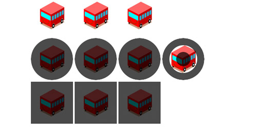
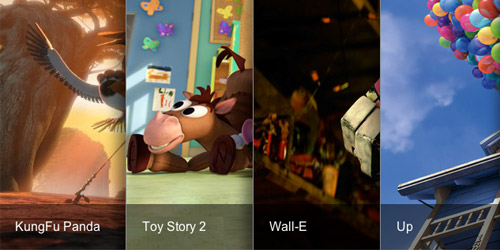
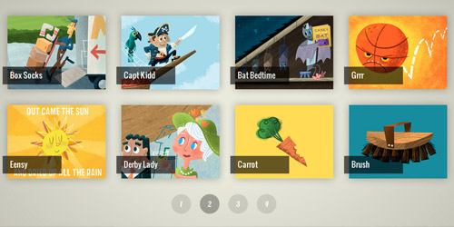
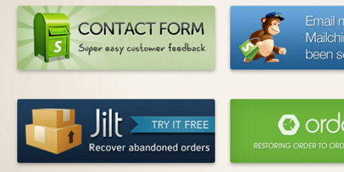
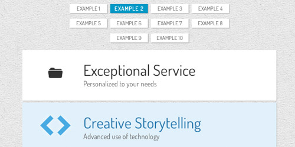
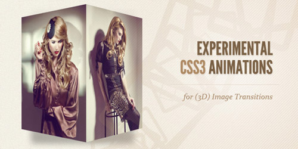
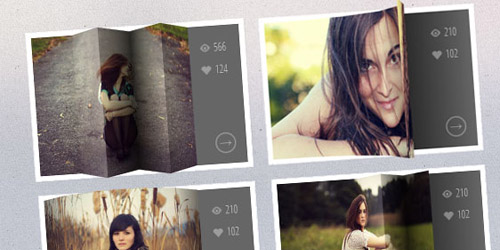
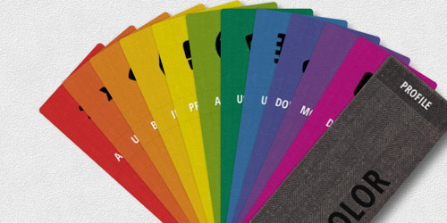
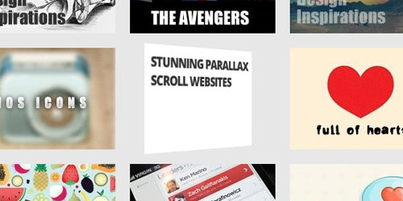
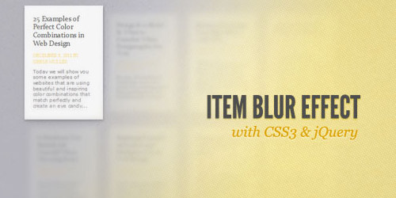

引进CSS3带来了很多令人兴奋的Web开发行业。CSS 3D变换的支持下，在以前是不可能的，这是可能的。CSS3只是一个造型技术在网页设计中常用的，但引进的动画性能和3D转换属性，我们可以很容易地创建很酷的动画，加上相结合的Javascript，令人惊艳的效果！

在这篇文章中，我们已经收集了11 CSS3相关的教程，告诉你如何做出令人惊艳的效果，一些experimentals，但放心，这是CSS的未来。

[放大镜实现图像缩放，使用jQuery和CSS3](http://thecodeplayer.com/walkthrough/magnifying-glass-for-images-using-jquery-and-css3)

学习如何使用jQuery和CSS3做一个现实的放大镜。将鼠标悬停的图像上看到的动作。
[简单而惊人的CSS3边框过渡效果](http://thecodeplayer.com/walkthrough/simple-yet-amazing-css3-border-transition-effects)

一些疯狂的效应与边界变迁。
[手风琴式滑块CSS3](http://thecodeplayer.com/walkthrough/make-an-accordian-style-slider-in-css3)

手风琴滑块（悬停根据），在CSS3使用非常少的代码。没有JavaScript的使用。标记和CSS的逻辑是非常简单的。此滑块可扩展到任意数量的图像，并可以很容易地在网站中使用。一个非常实用的作品，不仅仅是时尚。

[组合翻转滑块使用jQuery和CSS3](http://www.webstuffshare.com/2012/07/portfolio-flipping-slider-using-jquery-css3/)

[CSS3 3D变换](http://www.webstuffshare.com/2012/04/showing-product-information-with-css3-3d-transform/)

在本教程中，笔者要和大家分享如何显示我们的产品信息的使用CSS3 3D转换立方体风格。

[创意CSS3动画菜单](http://tympanus.net/codrops/2011/10/24/creative-css3-animation-menus/)

的想法是，有一个简单的组成元素，图标，主标题和二级标题，将鼠标悬停动画只使用CSS过渡和动画。

[实验CSS3动画的图像转换](http://tympanus.net/codrops/2011/12/19/experimental-css3-animations-for-image-transitions/)

一些实验性的3D图像转换与您使用CSS3动画和jQuery。

[3D缩略图悬停效果](http://tympanus.net/codrops/2012/06/18/3d-thumbnail-hover-effects/)

本教程告诉你如何创造出一些令人兴奋的3D使用CSS3和jQuery的悬停效果。

[斯沃琪书使用CSS3和jQuery](http://tympanus.net/codrops/2012/07/02/swatch-book-with-css3-and-jquery/)

本教程是关于使用CSS旋转变换和JavaScript创建一个动画的样本书。这样做是为了显示一个样本书状结构，使单个样本或“表”点击。当点击一个样本，我们将旋转以显示选定的其他样本。

[创建CSS 3D变换卡翻转图片](http://www.queness.com/post/11493/create-css-3d-transform-card-flip-gallery)

[项目模糊效果，CSS3和jQuery](http://tympanus.net/codrops/2011/12/14/item-blur-effect-with-css3-and-jquery/)

本教程向您展示了如何创建一个简单的虚化效果的基于文本的项目。我们的想法是，有一组文本框将变得模糊，并调低后，我们将鼠标悬停在他们。

转载：[http://www.queness.com/post/12019/11-stunning-css3-and-jquery-powered-tutorials](http://www.queness.com/post/12019/11-stunning-css3-and-jquery-powered-tutorials)