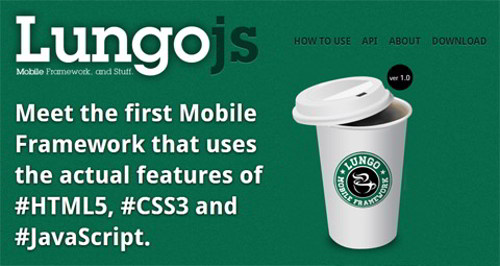
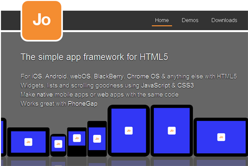
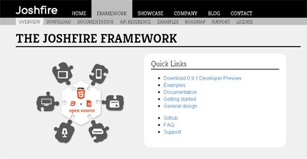
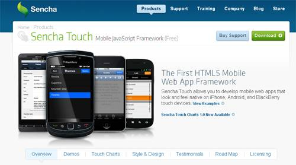
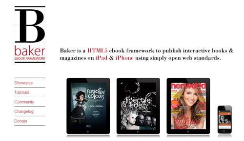
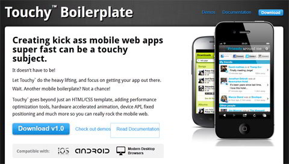
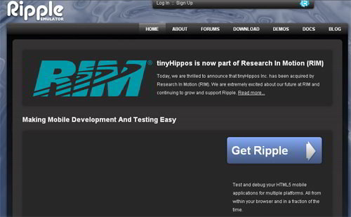
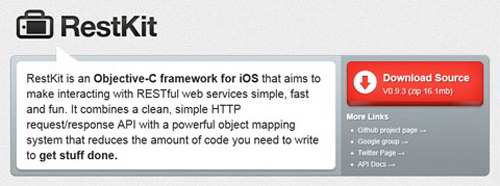
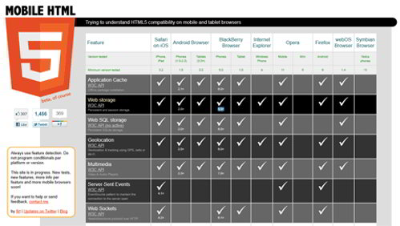
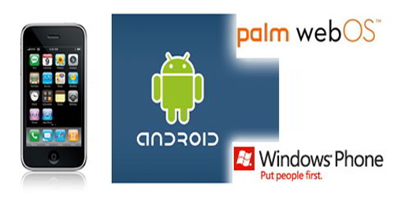

在过去的两年里，触屏设备飞速增长。iOS和Android设备让开发者和设计师开始重新思考他们的网页应用，以提供更好的触屏体验。

移动Web应用相对于本地的App有很多优势，虽然也有很多设计和开发上的挑战。这里列出了一系列有用的框架来帮助基于HTML的WebApp开发。他们支持大部分流行的智能手机和平板。

[Lungo.js：HTML5 移动开发框架](http://www.lungojs.com/)

Lungo.js是第一个应用HTML5和CSS3特性的移动开发框架。它可以帮助开发者创建iOS、Android、Blackberry和WebOS平台的应用。

Lungo.js不需要任何Web服务器的支持就能帮助用户实现HTML5的功能，例如WebSQL、 Geolocation、History、Device orientation等等。

[JO：一个简单的HTML5 App框架](http://www.joapp.com/)

JO可以帮助你创建类似本地应用的WebApp。JO是一个开源的免费框架，可以和PhoneGap一起使用。

[Joshfire：跨设备的开发框架](http://framework.joshfire.com/)

Joshfire是一个开源的跨设备开发框架，帮助开发者创建可以在多种设备上运行的WebApp。它使用HTML5和JavaScript，并且允许开发者快速整合本地应用和特定的Web应用。

Joshfire可以让你的应用接受键盘、鼠标、触摸屏、遥控器等设备的输入。Joshfire支持Node.JS。

[Sencha Touch：基于HTML5的移动网页开发框架](http://www.sencha.com/products/touch/)

Sencha touch可以让开发者创建类似本地应用体验的WebApp。Shencha是第一个使用HTML5、CSS和JavaScript并且支持音频/视频、本地存储、圆角、渐变背景以及阴影的开发框架。

[Baker：HTML5 电子书框架](http://bakerframework.com/)

Baker是用来在iPad或者iPhone平台上发布交互式的电子书或者电子杂志的HTML5电子书框架。

[Touchy Boilerplate](http://labs.doat.com/)

Touchy Boilerplate是一个用来创建移动WebApp，包括HTML模板、Meta tag等的工具。Touchy可以支持动态页面导航、固定页头、滚动内容、浏览历史记录等功能。Touchy使用jQuery或者Zepto.JS。

[Ripple：让移动开发测试更容易](http://ripple.tinyhippos.com/)

在不同的平台上测试移动应用是一件令人头疼的事情。Ripple可以帮助你在不同的平台上测试并且调试你的HTML5移动应用。Ripple是一个chrome的扩展。它可以模拟每个设备的详细信息，例如user_Agent、Geolocation等等。

[RestKit](http://restkit.org/)

Restkit是一个objective-c的开发框架，目的是简化并加快与Restful的Web service交互。它提供了一个简洁的HTTP request/response API和一个强大的对象映射系统。

[HTML5 兼容性表格](http://mobilehtml5.org/)

Mobile HTML5是一个表格，显示了不同设备/平台对HTML5特性的支持情况。包括Safari、Android、Blackberry、IE、Opera、Firefox、WebOS和Symbian。

[MobileESP：检测你的移动网页访问者](http://blog.mobileesp.com/)

