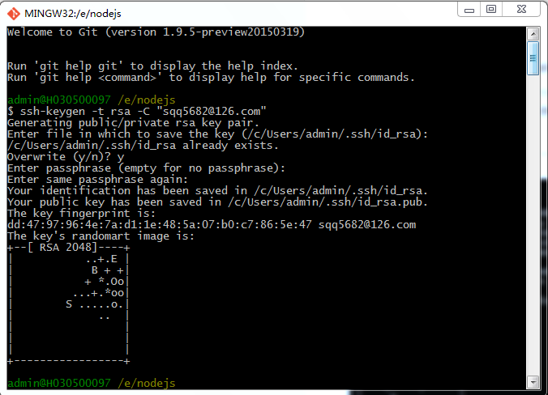
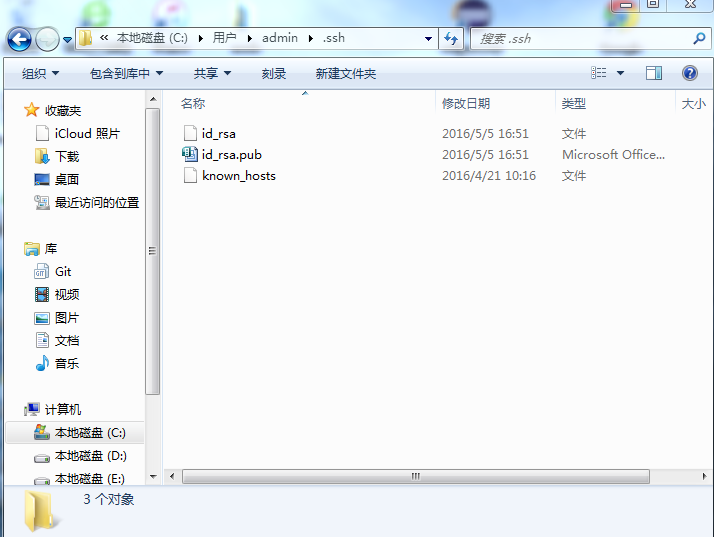
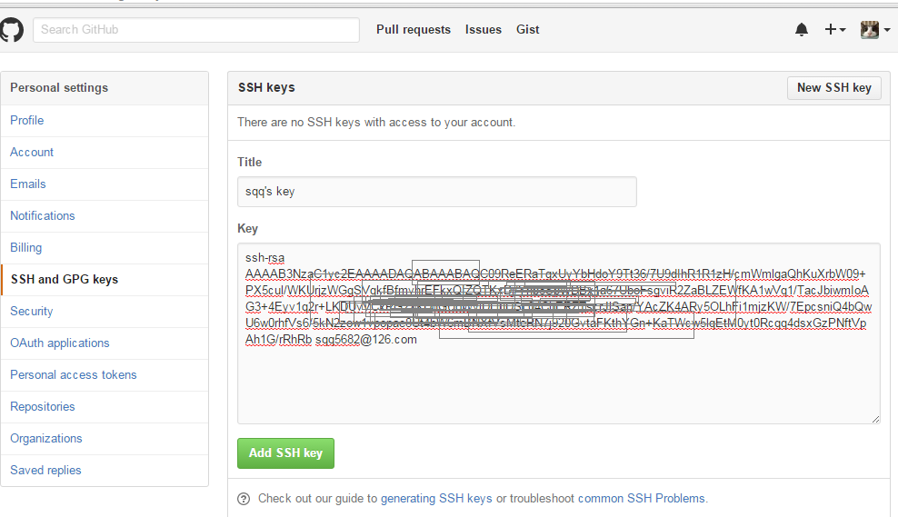
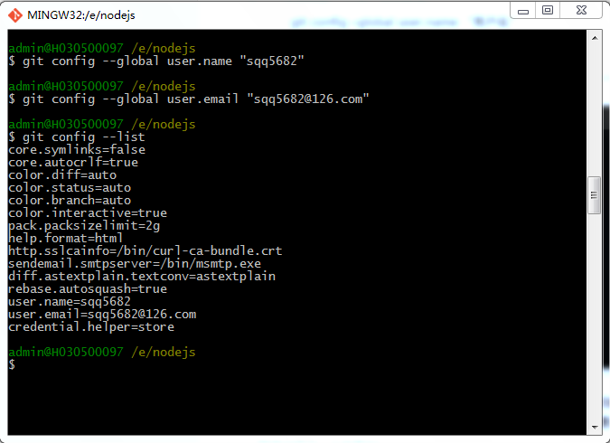
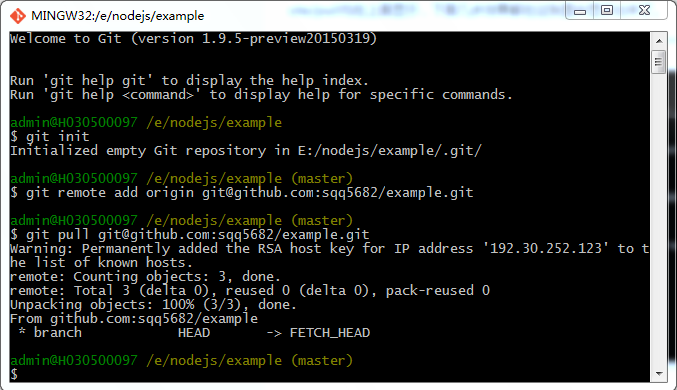
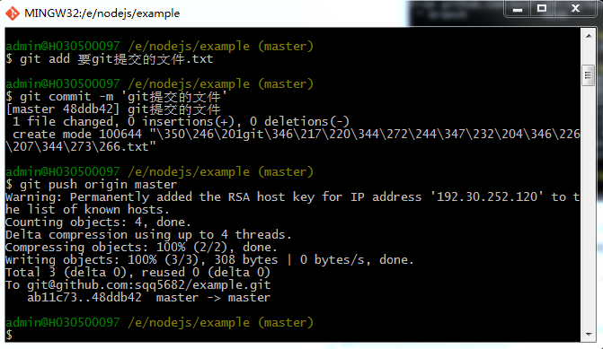
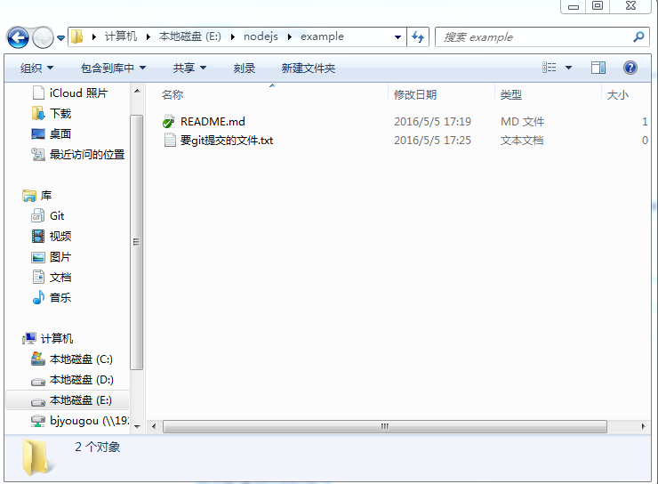
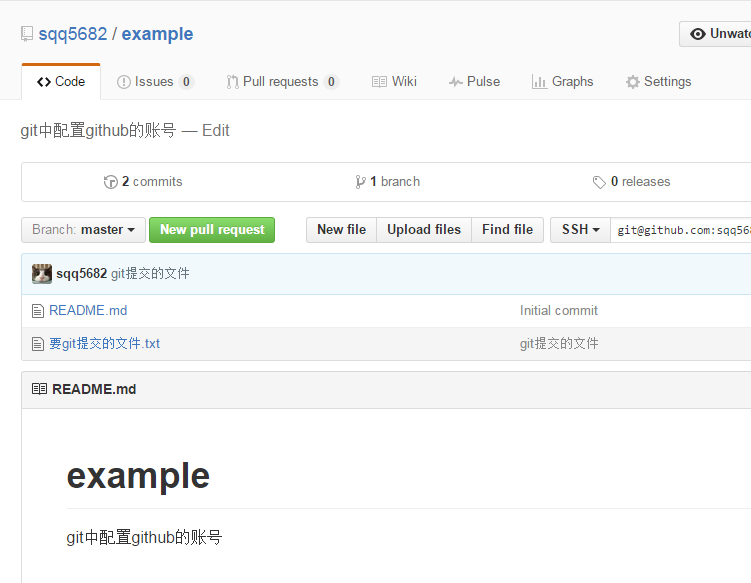

这里说的是window下操作，首先要有一个[https://github.com/](github)账号，以及安装[http://git-scm.com/download/](git)软件

1.先输入ssh-keygen –t rsa –C “邮箱地址”,注意ssh-keygen之间是没有空格的,其他的之间是有空格的

2.回车之后,会出现一行,让你输入一个保存密钥的地方,括号里面是它默认的位置，这里会让你输入几次内容，都不用输入，直接回车就可以了，可以看到如图的效果（这里最好都不要输入，直接回车）,我这里已经保存过了，现在提示是否覆盖，回车确认后，重新生成文件

3.回车之后,这样密钥就生成了,可以打开id_rsa.pub来查看,里面的所有内容就是这个密钥,一会需要使用的时候,就直接全选复制就可以了.

4.然后在github上登录账号，点击头像，下面有Setting选项，再选择左侧的SSH and GPGkeys  点击右侧的New SSH key,把复制的密钥粘贴在key一栏,title哪里可以自己起个名字

5.验证一下是否设置成功,在git bash下输入如下命令：

	ssh –T git@github.com

如果你是第一次，会让你输入yes或no,这时输入yes就可以了，其它显示就和我这个是一样的。如果你的是出现不是这些内容，有可能是显示权限问题什么的，就应该是我上面提到的那种情况，你看一下你生成密钥时是否操作正确，目录下是否有那个known_hosts这个文件

6.现在配置一下用户名和邮箱：

	git config –global user.name “用户名”
	git config –global user.email “邮箱”

配置好后可以git config --list查看确认一下用户名

7.账号配置好了，现在在github下新建一个仓库example

本地也新建个文件example，在文件中空白地方右键选择Git Bash Here，进入git命令终端界面，这时候输入 git init，来完成初始化工作。如图一共有三个命令，init/remote/pull，初始git,关联仓库，拉取文件

8.关于提交文件，本地可以新建个文件，比如文件名字为'要git提交的文件.txt'，如图，注意先add>commit>push

