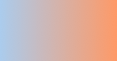

SS3发布很久了，现在在国外的一些页面上常能看到他的身影，这让我羡慕已久，只可惜在国内为了兼容IE，让这一项技术受到很大的限制，很多Web前端人员都望而止步。虽然如此但还是有很多朋友在钻研CSS3在web中的应用，为了不被淘汰，我也开始向CSS3进发，争取跟上技术的前沿。从现在开始我会不断的发布一些CSS3的应用，和大家一起分享，今天我们首先要看的就是:CSS3渐变─Gradient。

CSS3 Gradient分为linear-gradient(线性渐变)和radial-gradient(径向渐变)。而我们今天主要是针对线性渐变来剖析其具体的用法。为了更好的应用CSS3 Gradient,我们需要先了解一下目前的几种现代浏览器的内核，主流内容主要有Mozilla（熟悉的有Firefox，Flock等浏览器）、WebKit（熟悉的有Safari、Chrome等浏览器）、Opera（Opera浏览器）、Trident（讨厌的IE浏览器）。本文照常忽略IE不管，我们主要看看在Mozilla、Webkit、Opera下的应用，当然在IE下也可以实现，他需要通过IE特有的滤镜来实现，在后面会列出滤镜的使用语法，但不会具体介绍如何实用，感兴趣的可以搜索相关技术文档。那我们了解了这些，现在就开始今天的主题吧。

#### CSS3的线性渐变

**一、线性渐变在Mozilla下的应用**

语法：

> -moz-linear-gradient( [<point> || <angle>,]? <stop>, <stop> [, <stop>]* )

**参数：**其共有三个参数，第一个参数表示线性渐变的方向，top是从上到下、left是从左到右，如果定义成left top，那就是从左上角到右下角。第二个和第三个参数分别是起点颜色和终点颜色。你还可以在它们之间插入更多的参数，表示多种颜色的渐变。

根据上面的介绍，我们先来看一个简单的例子：

**HTML：**

	

**CSS：**

	.example {
		width: 150px;
		height: 80px;
	}

现在我们给这个div应用一个简单的渐变样式：

	.example1 {
		background: -moz-linear-gradient( top,#ccc,#000);
	}

效果如下：

注：这个效果暂时只有在Mozilla内核的浏览器下才能正常显示。

**二、线性渐变在Webkit下的应用**

语法：

> -webkit-linear-gradient( [<point> || <angle>,]? <stop>, <stop> [, <stop>]* )//最新发布书写语法  
> -webkit-gradient(<type>, <point> [, <radius>]?, <point> [, <radius>]? [, <stop>]*) //老式语法

书写规则

参数：-webkit-gradient是webkit引擎对渐变的实现参数，一共有五个。第一个参数表示渐变类型（type），可以是linear（线性渐变）或者radial（径向渐变）。第二个参数和第三个参数，都是一对值，分别表示渐变起点和终点。这对值可以用坐标形式表示，也可以用关键值表示，比如 left top（左上角）和left bottom（左下角）。第四个和第五个参数，分别是两个color-stop函数。color-stop函数接受两个参数，第一个表示渐变的位置，0为起点，0.5为中点，1为结束点；第二个表示该点的颜色。如图所示：

我们先来看一个老式的写法示例：

	background: -webkit-gradient(linear,center top,center bottom,from(#ccc), to(#000));

效果如下所示

接着我们在来看一下新式的写法：

	-webkit-linear-gradient(top,#ccc,#000);

这个效果和Mozilla一样，只是前缀不一样。

**三、线性渐变在Opera下的应用**

语法：

> -o-linear-gradient([<point> || <angle>,]? <stop>, <stop> [, <stop>]); /* Opera 11.10+ */

参数：-o-linear-gradient有三个参数。第一个参数表示线性渐变的方向，top是从上到下、left是从左到右，如果定义成left top，那就是从左上角到右下角。第二个和第三个参数分别是起点颜色和终点颜色。你还可以在它们之间插入更多的参数，表示多种颜色的渐变。（注：Opera支持的版本有限，本例测试都是在Opera11.1版本下，后面不在提示），如图所示：

示例：

	background: -o-linear-gradient(top,#ccc, #000);

效果如图所示

**四、线性渐变在Trident (IE)下的应用**

语法：

> filter: progid:DXImageTransform.Microsoft.gradient(GradientType=0, startColorstr=#1471da, endColorstr=#1C85FB);/*IE<9>*/  
> -ms-filter: "progid:DXImageTransform.Microsoft.gradient (GradientType=0, startColorstr=#1471da, endColorstr=#1C85FB)";/*IE8+*/

IE依靠滤镜实现渐变。startColorstr表示起点的颜色，endColorstr表示终点颜色。GradientType表示渐变类型，0为缺省值，表示垂直渐变，1表示水平渐变。如图所示：

上面我们主要介绍了线性渐变在上述四大核心模块下的实现方法，接着我们主要针对线性渐变在MOZ、Webkit、Opera三大模块下实现各种不同线性渐变实例：

从上面的语法中我们可以很清楚的知道，要创建一个线性渐变，我们需要创建一个起点和一个渐变方向（或角度），定义一个起始色：

> -moz-linear-gradient( [<point> || <angle>,]? <stop>, <stop> [, <stop>]* )  
> -webkit-linear-gradient( [<point> || <angle>,]? <stop>, <stop> [, <stop>]* )  
> -o-linear-gradient( [<point> || <angle>,]? <stop>, <stop> [, <stop>]* )

具体应用如下：

	background:-moz-linear-gradient(left,#ace,#f96);/*Mozilla*/
	background:-webkit-gradient(linear,0 50%,100% 50%,from(#ace),to(#f96));/*Old gradient for webkit*/
	background:-webkit-linear-gradient(left,#ace,#f96);/*new gradient for Webkit*/
	background:-o-linear-gradient(left,#ace,#f96); /*Opera11*/

效果如下：

起始点（Starting Point）的工作方式类似于background position。您可以设置水平和垂直位置为百分比，或以像素为单位，或在水平方向上可以使用left/center/right，在垂直方向上可以使用top/center/bottom。位置起始于左上角。如果你不指定水平或垂直位置，它将默认为center。其工作方式主要包含：Top → Bottom、Left → Right、bottom → top、right → left等，接着我们主要一种一种来看其实现的效果：

1、开始于center（水平方向）和top（垂直方向）也就是Top → Bottom：

	/* Firefox 3.6+ */
	background: -moz-linear-gradient(top, #ace, #f96);
	/* Safari 4-5, Chrome 1-9 */
	/* -webkit-gradient(, [, ]?, [, ]? [, ]*) */
	background: -webkit-gradient(linear,top,from(#ace),to(#f96));
	/* Safari 5.1+, Chrome 10+ */
	background: -webkit-linear-gradient(top, #ace, #f96);
	/* Opera 11.10+ */
	background: -o-linear-gradient(top, #ace, #f96);

效果：

2、始于left（水平方向）和center（垂直方向）也是就Left → Right：

	/* Firefox 3.6+ */
	background: -moz-linear-gradient(left, #ace, #f96);
	/* Safari 5.1+, Chrome 10+ */
	background: -webkit-linear-gradient(left, #ace, #f96);
	/* Opera 11.10+ */
	background: -o-linear-gradient(left, #ace, #f96);

效果如下：

3、起始于left（水平方向）和top（垂直方向）:

	background: -moz-linear-gradient(left top, #ace, #f96);
	background: -webkit-linear-gradient(left top, #ace, #f96);
	background: -o-linear-gradient(left top, #ace, #f96);

效果如下：

4、Linear Gradient (with Even Stops):

	/* Firefox 3.6+ */
	background: -moz-linear-gradient(left, #ace, #f96, #ace, #f96, #ace);
	/* Safari 4-5, Chrome 1-9 */
	background: -webkit-gradient(linear, left top, right top, from(#ace), color-stop(0.25, #f96), color-stop(0.5, #ace), color-stop(0.75, #f96), to(#ace));
	/* Safari 5.1+, Chrome 10+ */
	background: -webkit-linear-gradient(left, #ace, #f96, #ace, #f96, #ace);
	/* Opera 11.10+ */
	background: -o-linear-gradient(left, #ace, #f96, #ace, #f96, #ace);

效果如下：

5、with Specified Arbitrary Stops：

	/* Firefox 3.6+ */
	background: -moz-linear-gradient(left, #ace, #f96 5%, #ace, #f96 95%, #ace);
	/* Safari 4-5, Chrome 1-9 */
	background: -webkit-gradient(linear, left top, right top, from(#ace), color-stop(0.05, #f96), color-stop(0.5, #ace), color-stop(0.95, #f96), to(#ace));
	/* Safari 5.1+, Chrome 10+ */
	background: -webkit-linear-gradient(left, #ace, #f96 5%, #ace, #f96 95%, #ace);
	/* Opera 11.10+ */
	background: -o-linear-gradient(left, #ace, #f96 5%, #ace, #f96 95%, #ace);

效果如下：

6、角度(Angle)：

正如上面看到的示例，如果您不指定一个角度，它会根据起始位置自动定义。如果你想更多的控制渐变的方向，您不妨设置角度试试。例如，下面的两个渐变具有相同的起点left center，但是加上一个30度的角度。

没有角度的示例代码：

	background: -moz-linear-gradient(left, #ace, #f96);
	background: -webkit-linear-gradient(left,#ace,#f96);
	background: -o-linear-gradient(left, #ace, #f96);

加上30度的角度代码：

	background: -moz-linear-gradient(left 30deg, #ace, #f96);
	background: -webkit-gradient(linear, 0 0, 100% 100%, from(#ace),to(#f96));
	background: -o-linear-gradient(30deg, #ace, #f96);

效果图如下：

当指定的角度，请记住，它是一个由水平线与渐变线产生的的角度，逆时针方向。因此，使用0deg将产生一个左到右横向梯度，而90度将创建一个从底部到顶部的垂直渐变。我来看看你核心代码：

	background: -moz-linear-gradient(<angle>, #ace, #f96);
	background: -webkit-gradient(<type>,<angle>, from(#ace), to(#f96));
	background: -webkit-linear-gradient(<angle>, #ace, #f96);
	background: -o-linear-gradient(<angle>, #ace, #f96);

我们来看看各角度的区别

	.deg0 {
		background: -moz-linear-gradient(0deg, #ace, #f96);
		background: -webkit-gradient(linear,0 50%,100% 50%,from(#ace),to(#f96));
		background: -webkit-linear-gradient(0deg, #ace, #f96);
		background: -o-linear-gradient(0deg, #ace, #f96);
	}
	.deg45 {
		background: -moz-linear-gradient(45deg, #ace, #f96);
		background: -webkit-gradient(linear,0 100%,100% 0%,from(#ace),to(#f96));
		background: -webkit-linear-gradient(45deg, #ace, #f96);
		background: -o-linear-gradient(45deg, #ace, #f96);
	}
	.deg90 {
		background: -moz-linear-gradient(90deg, #ace, #f96);
		background: -webkit-gradient(linear,50% 100%,50% 0%,from(#ace),to(#f96));
		background: -webkit-linear-gradient(90deg, #ace, #f96);
		background: -o-linear-gradient(90deg, #ace, #f96);
	}
	.deg135 {
		background: -moz-linear-gradient(135deg, #ace, #f96);
		background: -webkit-gradient(linear,100% 100%,0 0,from(#ace),to(#f96));
		background: -webkit-linear-gradient(135deg, #ace, #f96);
		background: -o-linear-gradient(135deg, #ace, #f96);
	}
	.deg180 {
		background: -moz-linear-gradient(180deg, #ace, #f96);
		background: -webkit-gradient(linear,100% 50%,0 50%,from(#ace),to(#f96));
		background: -webkit-linear-gradient(180deg, #ace, #f96);
		background: -o-linear-gradient(180deg, #ace, #f96);
	}
	.deg225 {
		background: -moz-linear-gradient(225deg, #ace, #f96);
		background: -webkit-gradient(linear,100% 0%,0 100%,from(#ace),to(#f96));
		background: -webkit-linear-gradient(225deg, #ace, #f96);
		background: -o-linear-gradient(225deg, #ace, #f96);
	}
	.deg270 {
		background: -moz-linear-gradient(270deg, #ace, #f96);
		background: -webkit-gradient(linear,50% 0%,50% 100%,from(#ace),to(#f96));
		background: -webkit-linear-gradient(270deg, #ace, #f96);
		background: -o-linear-gradient(270deg, #ace, #f96);
	}
	.deg315 {
		background: -moz-linear-gradient(315deg, #ace, #f96);
		background: -webkit-gradient(linear,0% 0%,100% 100%,from(#ace),to(#f96));
		background: -webkit-linear-gradient(315deg, #ace, #f96);
		background: -o-linear-gradient(315deg, #ace, #f96);
	}
	.deg360 {
		background: -moz-linear-gradient(360deg, #ace, #f96);
		background: -webkit-gradient(linear,0 50%,100% 50%,from(#ace),to(#f96));
		background: -webkit-linear-gradient(360deg, #ace, #f96);
		background: -o-linear-gradient(360deg, #ace, #f96);
	}

效果如下：

除了起始位置和角度，你应该指定起止颜色。起止颜色是沿着渐变线，将会在指定位置（以百分比或长度设定）含有指定颜色的点。色彩的起止数是无限的。如果您使用一个百分比位置，0％代表起点和100％是终点，但区域外的值可以被用来达到预期的效果。 这也是通过CSS3 Gradient制作渐变的一个关键所在，其直接影响了你的设计效果，像我们这里的示例都不是完美的效果，只是为了能给大家展示一个渐变的效果，大家就这样先用着吧。我们接着看一下不同的起址色的示例：

	background: -moz-linear-gradient(top, #ace, #f96 80%, #f96);
	background: -webkit-linear-gradient(top,#ace,#f96 80%,#f96);
	background: -o-linear-gradient(top, #ace, #f96 80%, #f96);

效果如下：

如果没有指定位置，颜色会均匀分布。如下面的示例：

	background: -moz-linear-gradient(left, red, #f96, yellow, green, #ace);
	background: -webkit-linear-gradient(left,red,#f96,yellow,green,#ace);
	background: -o-linear-gradient(left, red, #f96, yellow, green, #ace);

效果如下

7、渐变上应用透明─透明度(Transparency)：

透明度还支持透明渐变。这对于制作一些特殊的效果是相当有用的，例如，当堆叠多个背景时。这里是两个背景的结合：一张图片，一个白色到透明的线性渐变。我们来看一个官网的示例吧：

	background: -moz-linear-gradient(right, rgba(255,255,255,0), rgba(255,255,255,1)),url(http://demos.hacks.mozilla.org/openweb/resources/images/patterns/flowers-pattern.jpg);
	background: -webkit-linear-gradient(right, rgba(255,255,255,0), rgba(255,255,255,1)),url(http://demos.hacks.mozilla.org/openweb/resources/images/patterns/flowers-pattern.jpg);
	background: -o-linear-gradient(right, rgba(255,255,255,0), rgba(255,255,255,1)),url(http://demos.hacks.mozilla.org/openweb/resources/images/patterns/flowers-pattern.jpg);

接着看看效果吧

大家可以时入这里和原图做一下比较，是不是很神奇呀。如果想体会的话，快点动手跟我一起做吧。

上面我们主要介绍了CSS3中线性渐变，文章一开始说过CSS3渐变包含两个部分，其一就是我们说的线性渐变，其二就是我们接下来要说的径向渐变。

CSS3的径向渐变

CSS3的径向渐变和其线性渐变是很相似的。我们首先来看其语法：

> -moz-radial-gradient([<bg-position> || <angle>,]? [<shape> || <size>,]? <color-stop>, <color-stop>[, <color-stop>]*);  
> -webkit-radial-gradient([<bg-position> || <angle>,]? [<shape> || <size>,]? <color-stop>, <color-stop>[, <color-stop>]*);

（需要特别说明一点的是，径向渐变到目前还不支持Opera的内核浏览器，所以我们径向渐变都是在firefox,safari,chrome底下进行测试完成的。）

除了您已经在线性渐变中看到的起始位置，方向，和颜色，径向梯度允许你指定渐变的形状（圆形或椭圆形）和大小（最近端，最近角，最远端，最远角，包含或覆盖 (closest-side, closest-corner, farthest-side, farthest-corner, contain or cover)）。 颜色起止(Color stops)：就像用线性渐变，你应该沿着渐变线定义渐变的起止颜色。下面为了更好的理解其具体的用法，我们主要通过不同的示例来对比CSS3径向渐变的具体用法

示例一：

	background: -moz-radial-gradient(#ace, #f96, #1E90FF);
	background: -webkit-radial-gradient(#ace, #f96, #1E90FF);

效果：

示例二：

	background: -moz-radial-gradient(#ace 5%, #f96 25%, #1E90FF 50%);
	background: -webkit-radial-gradient(#ace 5%, #f96 25%, #1E90FF 50%);

效果：

从以上俩个示例的代码中发现，他们起止色想同，但就是示例二定位了些数据，为什么会造成这么大的区别呢？其实在径向渐变中虽然具有相同的起止色，但是在没有设置位置时，其默认颜色为均匀间隔，这一点和我们前面的线性渐变是一样的，但是设置了渐变位置就会按照渐变位置去渐变，这就是我们示例一和示例的区别之处：虽然圆具有相同的起止颜色，但在示例一为默认的颜色间隔均匀的渐变，而示例二每种颜色都有特定的位置。

示例三

	background: -moz-radial-gradient(bottom left, circle, #ace, #f96, #1E90FF);
	background: -webkit-radial-gradient(bottom left, circle, #ace, #f96, #1E90FF);

效果

示例四

	background: -moz-radial-gradient(bottom left, ellipse, #ace, #f96, #1E90FF);
	background: -webkit-radial-gradient(bottom left, ellipse, #ace, #f96, #1E90FF);

效果

示例三和示例四我们从效果中就可以看出，其形状不一样，示例三程圆形而示例四程椭圆形状，也是就是说他们存在形状上的差异。然而我们在回到两个示例的代码中，显然在示例三中设置其形状为circle而在示例四中ellipse，换而言之在径向渐变中，我们是可以会渐变设置其形状的。

示例五

	background: -moz-radial-gradient(ellipse closest-side, #ace, #f96 10%, #1E90FF 50%, #f96);
	background: -webkit-radial-gradient(ellipse closest-side, #ace, #f96 10%, #1E90FF 50%, #f96);

效果：

示例六

	background: -moz-radial-gradient(ellipse farthest-corner, #ace, #f96 10%, #1E90FF 50%, #f96);
	background: -webkit-radial-gradient(ellipse farthest-corner, #ace, #f96 10%, #1E90FF 50%, #f96);

效果：

从示例五和示例六中的代码中我们可以清楚知道，在示例五中我人应用了closest-side而在示例六中我们应用了farthest-corner。这样我们可以知道在径向渐变中我们还可以为其设置大小(Size)：size的不同选项(closest-side, closest-corner, farthest-side, farthest-corner, contain or cover)指向被用来定义圆或椭圆大小的点。 示例：椭圆的近边VS远角 下面的两个椭圆有不同的大小。示例五是由从起始点(center)到近边的距离设定的，而示例六是由从起始点到远角的的距离决定的。

示例七：

	background: -moz-radial-gradient(circle closest-side, #ace, #f96 10%, #1E90FF 50%, #f96);
	background: -webkit-radial-gradient(circle closest-side, #ace, #f96 10%, #1E90FF 50%, #f96);

效果：

示例八：

	background: -moz-radial-gradient(circle farthest-side, #ace, #f96 10%, #1E90FF 50%, #f96);
	background: -webkit-radial-gradient(circle farthest-side, #ace, #f96 10%, #1E90FF 50%, #f96);

效果：

示例七和示例八主要演示了圆的近边VS远边 ，示例七的圆的渐变大小由起始点(center)到近边的距离决定，而示例八的圆则有起始点到远边的距离决定。

示例九：

	background: -moz-radial-gradient(#ace, #f96, #1E90FF);
	background: -webkit-radial-gradient(#ace, #f96, #1E90FF);

效果：

示例十：

	background: -moz-radial-gradient(contain, #ace, #f96, #1E90FF);
	background: -webkit-radial-gradient(contain, #ace, #f96, #1E90FF);

效果：

示例九和示例十演示了包含圆 。在这里你可以看到示例九的默认圈，同一渐变版本，但是被包含的示例十的圆。

最后我们在来看两个实例一个是应用了中心定位和full sized,如下所示：

	/* Firefox 3.6+ */
	background: -moz-radial-gradient(circle, #ace, #f96);
	/* Safari 4-5, Chrome 1-9 */
	/* Can't specify a percentage size? Laaaaaame. */
	background: -webkit-gradient(radial, center center, 0, center center, 460, from(#ace), to(#f96));
	/* Safari 5.1+, Chrome 10+ */
	background: -webkit-radial-gradient(circle, #ace, #f96);

效果如下：

下面这个实例应用的是Positioned, Sized，请看代码和效果

	/* Firefox 3.6+ */
	/* -moz-radial-gradient( [ || ,]? [ || ,]? , [, ]* ) */
	background: -moz-radial-gradient(80% 20%, closest-corner, #ace, #f96);
	/* Safari 4-5, Chrome 1-9 */
	background: -webkit-gradient(radial, 80% 20%, 0, 80% 40%, 100, from(#ace), to(#f96));
	/* Safari 5.1+, Chrome 10+ */
	background: -webkit-radial-gradient(80% 20%, closest-corner, #ace, #f96);

效果：

到此关于CSS3的两种渐变方式我们都介绍完了。在浪费大家一点时间，我们看看CSS的重复渐变的应用。

如果您想重复一个渐变，您可以使用-moz-repeating-linear-gradient和-moz-repeating-radial-gradient。 在下面的例子，每个实例都指定了两个起止颜色，并无限重复。

	background: -moz-repeating-radial-gradient(#ace, #ace 5px, #f96 5px, #f96 10px);
	background: -webkit-repeating-radial-gradient(#ace, #ace 5px, #f96 5px, #f96 10px);

	background: -moz-repeating-linear-gradient(top left -45deg, #ace, #ace 5px, #f96 5px, #f96 10px);
	background: -webkit-repeating-linear-gradient(top left -45deg, #ace, #ace 5px, #f96 5px, #f96 10px);

效果：

有关于CSS3渐变的东西就完了，大家看完了肯定会想，他主要用在哪些方面呢？这个说起来就多了，最简单的就是制作背景，我们还可以应用其制作一些漂亮的按钮，还可以用他来制作patterns，我在这里列出几种制作patterns的示例代码吧：

HTML代码：

	<ul>
	<li class="gradient gradient1"></li>
	<li class="gradient gradient2"></li>
	<li class="gradient gradient3"></li>
	<li class="gradient gradient4"></li>
	<li class="gradient gradient5"></li>
	<li class="gradient gradient6"></li>
	</ul>

CSS 代码：

	ul {
		overflow: hidden;
		margin-top: 20px;
	}
	li{
		width: 150px;
		height: 80px;
		margin-bottom: 10px;
		float: left;
		margin-right: 5px;
		background: #ace;
		/*Controls the size*/
		-webkit-background-size: 20px 20px;
		-moz-background-size: 20px 20px;
		background-size: 20px 20px;
	}

	li.gradient1 {
		background-image: -webkit-gradient(
		linear,
		0 100%, 100% 0,
		color-stop(.25, rgba(255, 255, 255, .2)),
		color-stop(.25, transparent),
		color-stop(.5, transparent),
		color-stop(.5, rgba(255, 255, 255, .2)),
		color-stop(.75, rgba(255, 255, 255, .2)),
		color-stop(.75, transparent),
		to(transparent)
		);
		background-image: -moz-linear-gradient(
		45deg,
		rgba(255, 255, 255, .2) 25%,
		transparent 25%,
		transparent 50%,
		rgba(255, 255, 255, .2) 50%,
		rgba(255, 255, 255, .2) 75%,
		transparent 75%,
		transparent
		);
		background-image: -o-linear-gradient(
		45deg,
		rgba(255, 255, 255, .2) 25%,
		transparent 25%,
		transparent 50%,
		rgba(255, 255, 255, .2) 50%,
		rgba(255, 255, 255, .2) 75%,
		transparent 75%,
		transparent
		);
		background-image: linear-gradient(
		45deg,
		rgba(255, 255, 255, .2) 25%,
		transparent 25%,
		transparent 50%,
		gba(255, 255, 255, .2) 50%,
		rgba(255, 255, 255, .2) 75%,
		transparent 75%,
		transparent
		);
	}

	li.gradient2 {
		background-image: -webkit-gradient(linear, 0 0, 100% 100%,
		color-stop(.25, rgba(255, 255, 255, .2)), color-stop(.25, transparent),
		color-stop(.5, transparent), color-stop(.5, rgba(255, 255, 255, .2)),
		color-stop(.75, rgba(255, 255, 255, .2)), color-stop(.75, transparent),
		to(transparent));
		background-image: -moz-linear-gradient(-45deg, rgba(255, 255, 255, .2) 25%, transparent 25%,
		transparent 50%, rgba(255, 255, 255, .2) 50%, rgba(255, 255, 255, .2) 75%,
		transparent 75%, transparent);
		background-image: -o-linear-gradient(-45deg, rgba(255, 255, 255, .2) 25%, transparent 25%,
		transparent 50%, rgba(255, 255, 255, .2) 50%, rgba(255, 255, 255, .2) 75%,
		transparent 75%, transparent);
		background-image: linear-gradient(-45deg, rgba(255, 255, 255, .2) 25%, transparent 25%,
		transparent 50%, rgba(255, 255, 255, .2) 50%, rgba(255, 255, 255, .2) 75%,
		transparent 75%, transparent);
	}

	li.gradient3 {
		background-image: -webkit-gradient(linear, 0 0, 0 100%, color-stop(.5, rgba(255, 255, 255, .2)), color-stop(.5, transparent), to(transparent));
		background-image: -moz-linear-gradient(rgba(255, 255, 255, .2) 50%, transparent 50%, transparent);
		background-image: -o-linear-gradient(rgba(255, 255, 255, .2) 50%, transparent 50%, transparent);
		background-image: linear-gradient(rgba(255, 255, 255, .2) 50%, transparent 50%, transparent);
	}

	li.gradient4 {
		background-image: -webkit-gradient(linear, 0 0, 100% 0, color-stop(.5, rgba(255, 255, 255, .2)), color-stop(.5, transparent), to(transparent));
		background-image: -moz-linear-gradient(0deg, rgba(255, 255, 255, .2) 50%, transparent 50%, transparent);
		background-image: -o-linear-gradient(0deg, rgba(255, 255, 255, .2) 50%, transparent 50%, transparent);
		background-image: linear-gradient(0deg, rgba(255, 255, 255, .2) 50%, transparent 50%, transparent);
	}

	li.gradient5 {
		background-image: -webkit-gradient(linear, 0 0, 100% 100%, color-stop(.25, #555), color-stop(.25, transparent), to(transparent)),
		-webkit-gradient(linear, 0 100%, 100% 0, color-stop(.25, #555), color-stop(.25, transparent), to(transparent)),
		-webkit-gradient(linear, 0 0, 100% 100%, color-stop(.75, transparent), color-stop(.75, #555)),
		-webkit-gradient(linear, 0 100%, 100% 0, color-stop(.75, transparent), color-stop(.75, #555));
		background-image: -moz-linear-gradient(45deg, #555 25%, transparent 25%, transparent),
		-moz-linear-gradient(-45deg, #555 25%, transparent 25%, transparent),
		-moz-linear-gradient(45deg, transparent 75%, #555 75%),
		-moz-linear-gradient(-45deg, transparent 75%, #555 75%);
		background-image: -o-linear-gradient(45deg, #555 25%, transparent 25%, transparent),
		-o-linear-gradient(-45deg, #555 25%, transparent 25%, transparent),
		-o-linear-gradient(45deg, transparent 75%, #555 75%),
		-o-linear-gradient(-45deg, transparent 75%, #555 75%);
		background-image: linear-gradient(45deg, #555 25%, transparent 25%, transparent),
		linear-gradient(-45deg, #555 25%, transparent 25%, transparent),
		linear-gradient(45deg, transparent 75%, #555 75%),
		linear-gradient(-45deg, transparent 75%, #555 75%);
	}

	li.gradient6 {
		background-image: -webkit-gradient(linear, 0 0, 0 100%, color-stop(.5, transparent), color-stop(.5, rgba(200, 0, 0, .5)), to(rgba(200, 0, 0, .5))),
		-webkit-gradient(linear, 0 0, 100% 0, color-stop(.5, transparent), color-stop(.5, rgba(200, 0, 0, .5)), to(rgba(200, 0, 0, .5)));
		background-image: -moz-linear-gradient(transparent 50%, rgba(200, 0, 0, .5) 50%, rgba(200, 0, 0, .5)),
		-moz-linear-gradient(0deg, transparent 50%, rgba(200, 0, 0, .5) 50%, rgba(200, 0, 0, .5));
		background-image: -o-linear-gradient(transparent 50%, rgba(200, 0, 0, .5) 50%, rgba(200, 0, 0, .5)),
		-o-linear-gradient(0deg, transparent 50%, rgba(200, 0, 0, .5) 50%, rgba(200, 0, 0, .5));
		background-image: linear-gradient(transparent 50%, rgba(200, 0, 0, .5) 50%, rgba(200, 0, 0, .5)),
		linear-gradient(0deg, transparent 50%, rgba(200, 0, 0, .5) 50%, rgba(200, 0, 0, .5));
	}

效果：

不错的效果吧，当然感兴趣的朋友以后可以在这里学习更多的不同效果。