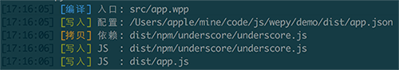
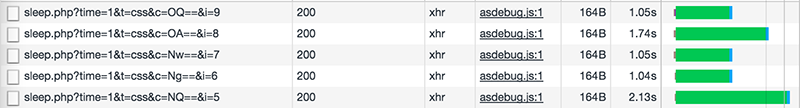
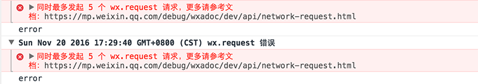
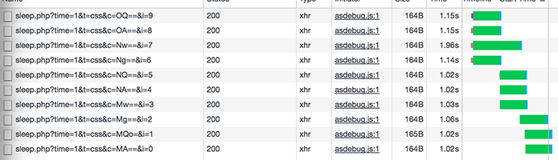
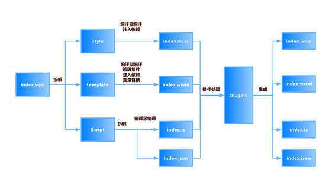

### 介绍

WePY 框架在开发过程中参考了 Vue 等现有框架的一些语法风格和功能特性，对原生小程序的开发模式进行了再次封装，更贴近于 MVVM 架构模式, 并支持ES6/7的一些新特性。

通过wepy开发的代码经过编译后，能生成一份完美运行在小程序端的代码，而且wepy的目的就是让小程序开发更贴近于传统H5框架开发，让小程序能像开发H5一样支持引入NPM包，支持组件化开发以及支持JS新特性等等。

#### 安装wepy

**以下安装都通过npm安装**

1.安装 wepy 命令行工具

	npm install wepy-cli -g

2.在开发目录生成开发DEMO

	wepy new myproject

3.开发实时编译

	wepy build --watch

#### 项目目录结构

	├── dist                   微信开发者工具指定的目录（该目录由WePY的build指令自动编译生成，请不要直接修改该目录下的文件）
	├── node_modules           
	├── src                    代码编写的目录（该目录为使用WePY后的开发目录）
	|   ├── components         WePY组件目录（组件不属于完整页面，仅供完整页面或其他组件引用）
	|   |   ├── com_a.wpy      可复用的WePY组件a
	|   |   └── com_b.wpy      可复用的WePY组件b
	|   ├── pages              WePY页面目录（属于完整页面）
	|   |   ├── index.wpy      index页面（经build后，会在dist目录下的pages目录生成index.js、index.json、index.wxml和index.wxss文件）
	|   |   └── other.wpy      other页面（经build后，会在dist目录下的pages目录生成other.js、other.json、other.wxml和other.wxss文件）
	|   └── app.wpy            小程序配置项（全局数据、样式、声明钩子等；经build后，会在dist目录下生成app.js、app.json和app.wxss文件）
	└── package.json           项目的package配置

#### 开发使用说明

1.使用微信开发者工具新建项目，本地开发选择dist目录。
2.微信开发者工具 → 项目 → 关闭ES6转ES5。
3.本地项目根目录运行wepy build --watch，开启实时编译。

#### 开发模式转换

在原有的小程序的开发模式下进行再次封装，更贴近于现有MVVM框架开发模式。框架在开发过程中参考了一些现在框架的一些特性，并且融入其中，以下是使用wepy前后的代码对比图。

官方DEMO代码：

	//index.js
	//获取应用实例
	var app = getApp()
	//通过Page构造函数创建页面逻辑
	Page({
	    //可用于页面模板绑定的数据
	    data: {
	        motto: 'Hello World',
	        userInfo: {}
	    },

	    //事件处理函数
	    bindViewTap: function() {
	        console.log('button clicked')
	    },

	    //页面的生命周期函数
	    onLoad: function () {
	        console.log('onLoad')
	    }
	})

基于WePY的代码：

	//index.wpy中的

#### 支持加载外部NPM包

在编译过程当中，会递归遍历代码中的require然后将对应依赖文件从node_modules当中拷贝出来，并且修改require为相对路径，从而实现对外部NPM包的支持。如下图：

#### 单文件模式，目录结构更清晰，开发更方便

原生小程序要求app实例必须有3个文件：app.js、app.json、app.wxss，而page页面则一般有4个文件：page.js、page.json、page.wxml、page.wxss，并且还要求app实例的3个文件以及page页面的4个文件除后缀名外必须同名，具体可参看官方目录结构。

而在WePY中则使用了单文件模式，将原生小程序app实例的3个文件统一为app.wpy，page页面的4个文件统一为page.wpy。使用WePY开发前后的开发目录结构对比如下：

原生小程序的目录结构：

	project
	├── pages
	|   ├── index
	|   |   ├── index.js    index 页面逻辑
	|   |   ├── index.json  index 页面配置
	|   |   ├── index.wxml  index 页面结构
	|   |   └── index.wxss  index 页面样式
	|   └── log
	|       ├── log.js      log 页面逻辑
	|       ├── log.json    log 页面配置
	|       ├── log.wxml    log 页面结构
	|       └── log.wxss    log 页面样式
	├── app.js              小程序逻辑
	├── app.json            小程序公共配置
	└── app.wxss            小程序公共样式

使用WePY框架后的开发目录结构(主要为src目录的结构，dist目录除外)：

> 注：dist目录为WePY通过build指令生成的目录，除额外增加的npm目录外，其目录结构与原生小程序的目录结构类似。

	project
	└── src
	    ├── pages
	    |   ├── index.wpy    index 页面逻辑、配置、结构、样式
	    |   └── log.wpy      log 页面逻辑、配置、结构、样式
	    └──app.wpy           小程序逻辑、公共配置、公共样式

#### 默认使用babel编译，支持ES6/7的一些新特性

用户可以通过修改wepy.config.js(老版本使用.wepyrc)配置文件，配置自己熟悉的babel环境进行开发。默认开启使用了一些新的特性如promise、async/await（自WePY 1.4.1开始必须手动开启，原因参见前文代码规范一节中的介绍）等等。

示例代码：

	import wepy from 'wepy';

	export default class Index extends wepy.page {
	    getData() {
	        return new Promise((resolve, reject) => {
	            setTimeout(() => {
	                resolve({data: 123});
	            }, 3000);
	        });
	    };

	    async onLoad() {
	        let data = await this.getData();
	        console.log(data.data);
	    };
	}

#### 针对原生API进行优化

对小程序原生API进行promise处理，同时修复了一些原生API的缺陷，比如：wx.request的并发问题等。

原生代码：

	onLoad = function () {
	    var self = this;
	    wx.login({
	        success: function (data) {
	            wx.getUserInfo({
	                success: function (userinfo) {
	                    self.setData({userInfo: userinfo});
	                }
	            });
	        }
	    });
	}

基于WePY的代码：

	import wepy from 'wepy';

	async onLoad() {
	    await wepy.login();
	    this.userInfo = await wepy.getUserInfo();
	}

在同时并发10个request请求测试时：

不使用WePY:

使用WePY后：

#### 进阶介绍-wepy.config.js配置文件说明

执行wepy new demo后，会生成类似下面这样的配置文件。

	let prod = process.env.NODE_ENV === 'production';

	module.exports = {
	    'output': 'dist',
	    'source': 'src',
	    'wpyExt': '.wpy',
	    'compilers': {
	        less: {
	            'compress': true
	        },
	        /*sass: {
	            'outputStyle': 'compressed'
	        },*/
	        babel: {
	            'presets': [
	                'es2015',
	                'stage-1'
	            ],
	            'plugins': [
	                'transform-export-extensions',
	                'syntax-export-extensions',
	                'transform-runtime'
	            ]
	        }
	    },
	    'plugins': {
	    }
	};

	if (prod) {
	    // 压缩sass
	    module.exports.compilers['sass'] = {'outputStyle': 'compressed'};

	    // 压缩less
	    module.exports.compilers['less'] = {'compress': true};

	    // 压缩js
	    module.exports.plugins = {
	        'uglifyjs': {
	            filter: /\.js$/,
	            config: {
	            }
	        },
	        'imagemin': {
	            filter: /\.(jpg|png|jpeg)$/,
	            config: {
	                'jpg': {
	                    quality: 80
	                },
	                'png': {
	                    quality: 80
	                }
	            }
	        }
	    };
	}

wpyExt：缺省值为’.wpy’，IDE默认情况下不会对此文件类型高亮，此时可以修改所有文件为.vue后缀(因为与vue高亮规则一样)，然后将此选项修改为.vue，就能解决部分IDE代码高亮问题。
sass：sass编译配置，参见[https://github.com/sass/node-sass](https://github.com/sass/node-sass)
less：less编译配置，参见[http://lesscss.org/#using-less-usage-in-code](http://lesscss.org/#using-less-usage-in-code)
babel：babel编译配置，参见[http://babeljs.io/docs/usage/options/](http://babeljs.io/docs/usage/options/)

### .wpy文件说明

.wpy文件的编译过程过下：

一个.wpy文件可分为三大部分，各自对应于一个标签：

1.脚本部分，即script标签中的内容，又可分为两个部分：逻辑部分，除了config对象之外的部分，对应于原生的.js文件；配置部分，即config对象，对应于原生的.json文件。

2.结构部分，即template模板部分，对应于原生的.wxml文件。

3.样式部分，即style样式部分，对应于原生的.wxss文件。

其中，小程序入口文件app.wpy不需要template，所以编译时会被忽略。.wpy文件中的script、template、style这三个标签都支持lang和src属性，lang决定了其代码编译过程，src决定是否外联代码，存在src属性且有效时，会忽略内联代码。

其他的脚本部分介绍，组件的渲染和通信交互可看官方文档介绍[wepy官方文档](https://mp.weixin.qq.com/s/2nQzsuqq7Avgs8wsRizUhw)
