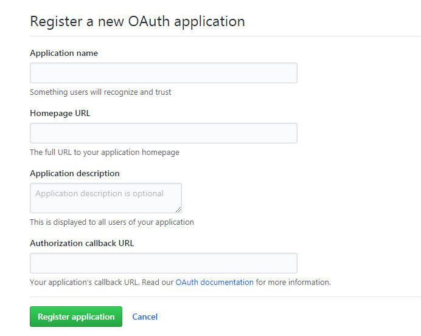
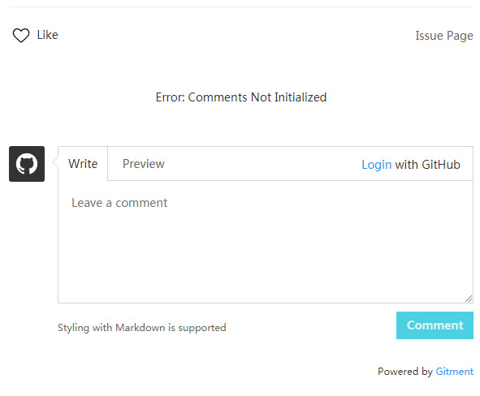
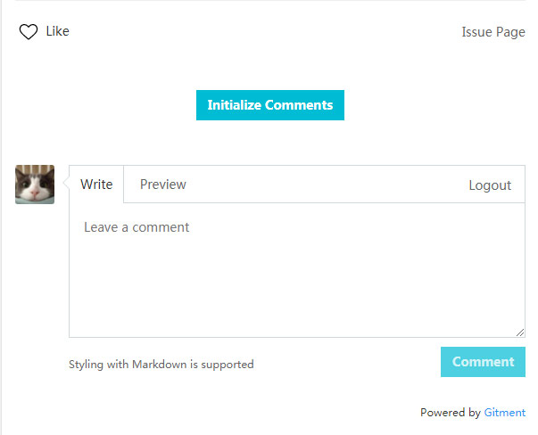
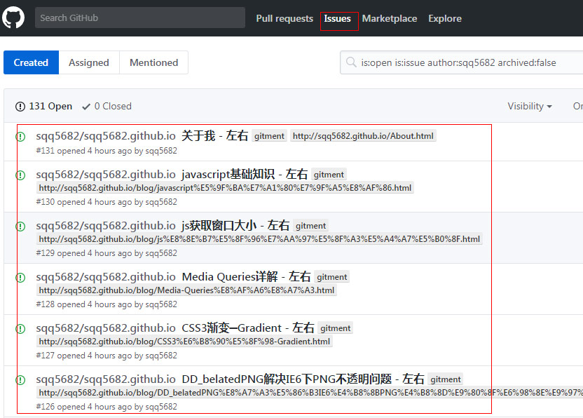
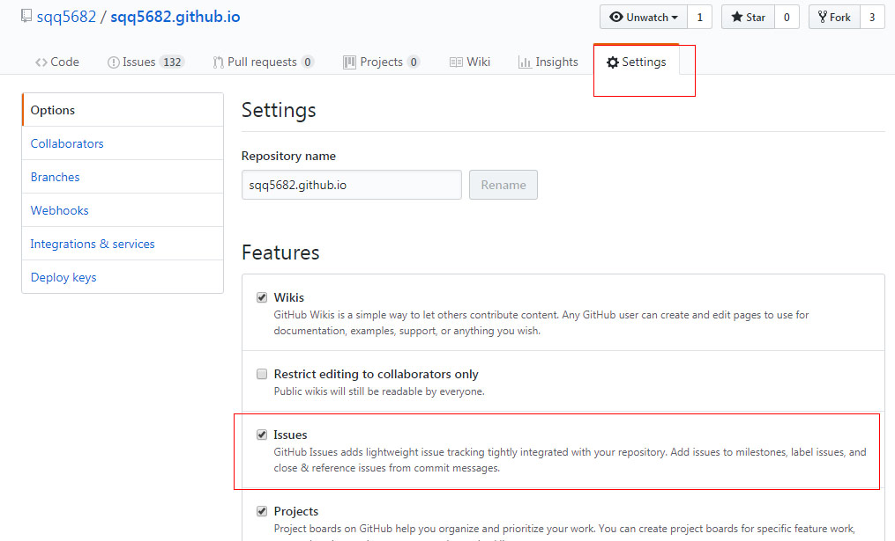

前一段时间在Github Pages上使用Jekyll搭建了个人博客[sqq5682.github.io](http://sqq5682.github.io)，现在把之前的wordpress博客上的内容搬了过来，添加评论时，找了几个国内的，有的需要备案的，搜了一下找到了gitment，gitment是imsun利用github上的issues做的评论，项目地址为[gitment](https://github.com/imsun/gitment)，然后着手开始自己的博客评论新建，同时也写一下。

**注册OAuth Application**

首先登录自己的github，在Github头像下拉菜单 > Settings > 左边Developer settings下的OAuth Application > Register a new application，填写下面信息，如下：

> Authorization callback URL  一定要写自己Github Pages的URL  比如我填的是http://sqq5682.github.io  

填写完上述信息后按Register application按钮，会得一个得到Client ID和Client Secret，这个将被用于之后的用户登录

**在jekyll博客引用gitment代码**

为了灵活和方便管理，可以在_config.yml中配置好全局参数：

	# Gitment
	gitment
	   id:ebd2bxxxxxxxx
	   secret:701e6d334e75xxxxxxxxxxxxxx

然后在文章页面添加如下代码

	

	<link rel="stylesheet" href="https://imsun.github.io/gitment/style/default.css">
	
	

这时打开文章页面会看到，Error: Comments Not Initialized，提示该篇博文的评论还没初始化

在右边点Login with GitHub，在GitHub进行授权后页面会刷新成：Initialize Comments

接着点击Initialize Comments按钮后，进行初始化就可以评论了

同时也可以在对应的github仓库看到相应的issue

ps:我碰到一个问题在上述点击Initialize Comments后有个错误提示为

	Error: Issues are disabled for this repo

出现这个问题，是由于对应的issue page没打开，可以在如下对应issue 打上对勾 就行了

如果碰到其他问题，可以看这里[gitment错误处理](https://github.com/imsun/gitment/issues)
