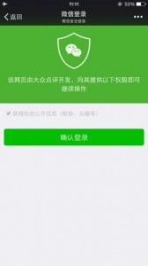

如果用户在微信客户端中访问第三方网页，公众号可以通过微信网页授权机制，来获取用户基本信息，进而实现业务逻辑。

#### 关于网页授权回调域名的说明

1. 在微信公众号请求用户网页授权之前，开发者需要先到公众平台官网中的开发者中心页配置授权回调域名。请注意，这里填写的是域名（是一个字符串），而不是URL，因此请勿加 http:// 等协议头；
2. 授权回调域名配置规范为全域名，比如需要网页授权的域名为：www.qq.com，配置以后此域名下面的页面http://www.qq.com/music.html 、 http://www.qq.com/login.html 都可以进行OAuth2.0鉴权。但http://pay.qq.com 、 http://music.qq.com 、 http://qq.com无法进行OAuth2.0鉴权
3. 如果公众号登录授权给了第三方开发者来进行管理，则不必做任何设置，由第三方代替公众号实现网页授权即可

#### 关于网页授权的两种scope的区别说明

1. 以snsapi_base为scope发起的网页授权，是用来获取进入页面的用户的openid的，并且是静默授权并自动跳转到回调页的。用户感知的就是直接进入了回调页（往往是业务页面）
2. 以snsapi_userinfo为scope发起的网页授权，是用来获取用户的基本信息的。但这种授权需要用户手动同意，并且由于用户同意过，所以无须关注，就可在授权后获取该用户的基本信息。
3. 用户管理类接口中的“获取用户基本信息接口”，是在用户和公众号产生消息交互或关注后事件推送后，才能根据用户OpenID来获取用户基本信息。这个接口，包括其他微信接口，都是需要该用户（即openid）关注了公众号后，才能调用成功的。

#### 关于网页授权access_token和普通access_token的区别

1. 微信网页授权是通过OAuth2.0机制实现的，在用户授权给公众号后，公众号可以获取到一个网页授权特有的接口调用凭证（网页授权access_token），通过网页授权access_token可以进行授权后接口调用，如获取用户基本信息；
2. 其他微信接口，需要通过基础支持中的“获取access_token”接口来获取到的普通access_token调用。

#### 关于UnionID机制

1. 请注意，网页授权获取用户基本信息也遵循UnionID机制。即如果开发者有在多个公众号，或在公众号、移动应用之间统一用户帐号的需求，需要前往微信开放平台（open.weixin.qq.com）绑定公众号后，才可利用UnionID机制来满足上述需求。
2. UnionID机制的作用说明：如果开发者拥有多个移动应用、网站应用和公众帐号，可通过获取用户基本信息中的unionid来区分用户的唯一性，因为同一用户，对同一个微信开放平台下的不同应用（移动应用、网站应用和公众帐号），unionid是相同的。

#### 关于特殊场景下的静默授权

1. 上面已经提到，对于以snsapi_base为scope的网页授权，就静默授权的，用户无感知；
2. 对于已关注公众号的用户，如果用户从公众号的会话或者自定义菜单进入本公众号的网页授权页，即使是scope为snsapi_userinfo，也是静默授权，用户无感知。

具体而言，网页授权流程分为四步：

1. 引导用户进入授权页面同意授权，获取code
2. 通过code换取网页授权access_token（与基础支持中的access_token不同）
3. 如果需要，开发者可以刷新网页授权access_token，避免过期
4. 通过网页授权access_token和openid获取用户基本信息（支持UnionID机制）

### 第一步：用户同意授权，获取code

在确保微信公众账号拥有授权作用域（scope参数）的权限的前提下（服务号获得高级接口后，默认拥有scope参数中的snsapi_base和snsapi_userinfo），引导关注者打开如下页面：

    https://open.weixin.qq.com/connect/oauth2/authorize?appid=APPID&redirect_uri=REDIRECT_URI&response_type=code&scope=SCOPE&state=STATE#wechat_redirect

若提示“该链接无法访问”，请检查参数是否填写错误，是否拥有scope参数对应的授权作用域权限。

尤其注意：由于授权操作安全等级较高，所以在发起授权请求时，微信会对授权链接做正则强匹配校验，如果链接的参数顺序不对，授权页面将无法正常访问

参考链接(请在微信客户端中打开此链接体验)

    Scope为snsapi_base
    https://open.weixin.qq.com/connect/oauth2/authorize?appid=wx520c15f417810387&redirect_uri=https%3A%2F%2Fchong.qq.com%2Fphp%2Findex.php%3Fd%3D%26c%3DwxAdapter%26m%3DmobileDeal%26showwxpaytitle%3D1%26vb2ctag%3D4_2030_5_1194_60&response_type=code&scope=snsapi_base&state=123#wechat_redirect
    Scope为snsapi_userinfo
    https://open.weixin.qq.com/connect/oauth2/authorize?appid=wxf0e81c3bee622d60&redirect_uri=http%3A%2F%2Fnba.bluewebgame.com%2Foauth_response.php&response_type=code&scope=snsapi_userinfo&state=STATE#wechat_redirect

尤其注意：跳转回调redirect_uri，应当使用https链接来确保授权code的安全性。

#### 参数说明

<table border="1" cellspacing="0" cellpadding="4" align="center" width="100%">
<tbody><tr>
<th style="width:120px">参数
</th>
<th style="width:120px">是否必须
</th>
<th>说明
</th></tr>
<tr>
<td> appid
</td>
<td> 是
</td>
<td> 公众号的唯一标识
</td></tr>
<tr>
<td> redirect_uri
</td>
<td> 是
</td>
<td> 授权后重定向的回调链接地址，请使用urlencode对链接进行处理
</td></tr>
<tr>
<td> response_type
</td>
<td> 是
</td>
<td> 返回类型，请填写code
</td></tr>
<tr>
<td> scope
</td>
<td> 是
</td>
<td> 应用授权作用域，snsapi_base （不弹出授权页面，直接跳转，只能获取用户openid），snsapi_userinfo （弹出授权页面，可通过openid拿到昵称、性别、所在地。并且，<b>即使在未关注的情况下，只要用户授权，也能获取其信息</b>）
</td></tr>
<tr>
<td> state
</td>
<td> 否
</td>
<td> 重定向后会带上state参数，开发者可以填写a-zA-Z0-9的参数值，最多128字节
</td></tr>
<tr>
<td> #wechat_redirect
</td>
<td> 是
</td>
<td> 无论直接打开还是做页面302重定向时候，必须带此参数
</td></tr>
</tbody></table>

下图为scope等于snsapi_userinfo时的授权页面：

如果用户同意授权，页面将跳转至 redirect_uri/?code=CODE&state=STATE。若用户禁止授权，则重定向后不会带上code参数，仅会带上state参数redirect_uri?state=STATE

#### code说明 ：

code作为换取access_token的票据，每次用户授权带上的code将不一样，code只能使用一次，5分钟未被使用自动过期。

### 第二步：通过code换取网页授权access_token

首先请注意，这里通过code换取的是一个特殊的网页授权access_token,与基础支持中的access_token（该access_token用于调用其他接口）不同。公众号可通过下述接口来获取网页授权access_token。如果网页授权的作用域为snsapi_base，则本步骤中获取到网页授权access_token的同时，也获取到了openid，snsapi_base式的网页授权流程即到此为止。

尤其注意：由于公众号的secret和获取到的access_token安全级别都非常高，必须只保存在服务器，不允许传给客户端。后续刷新access_token、通过access_token获取用户信息等步骤，也必须从服务器发起。

#### 请求方法:

获取code后，请求以下链接获取access_token： 
https://api.weixin.qq.com/sns/oauth2/access_token?appid=APPID&secret=SECRET&code=CODE&grant_type=authorization_code

#### 参数说明

<table border="1" cellspacing="0" cellpadding="4" align="center" width="100%">
<tbody><tr>
<th style="width:120px">参数
</th>
<th style="width:120px">是否必须
</th>
<th>说明
</th></tr>
<tr>
<td> appid
</td>
<td> 是
</td>
<td> 公众号的唯一标识
</td></tr>
<tr>
<td> secret
</td>
<td> 是
</td>
<td> 公众号的appsecret
</td></tr>
<tr>
<td> code
</td>
<td> 是
</td>
<td> 填写第一步获取的code参数
</td></tr>
<tr>
<td> grant_type
</td>
<td> 是
</td>
<td> 填写为authorization_code
</td></tr>
</tbody></table>

#### 返回说明

正确时返回的JSON数据包如下：

    {
     "access_token":"ACCESS_TOKEN",
     "expires_in":7200,
     "refresh_token":"REFRESH_TOKEN",
     "openid":"OPENID",
     "scope":"SCOPE"
    }

<table border="1" cellspacing="0" cellpadding="4" width="100%" align="center">
<tbody><tr>
<th style="width:180px">参数
</th>
<th style="width:470px">描述
</th></tr>
<tr>
<td> access_token
</td>
<td> 网页授权接口调用凭证,注意：此access_token与基础支持的access_token不同
</td></tr>
<tr>
<td> expires_in
</td>
<td> access_token接口调用凭证超时时间，单位（秒）
</td></tr>
<tr>
<td> refresh_token
</td>
<td> 用户刷新access_token
</td></tr>
<tr>
<td> openid
</td>
<td> 用户唯一标识，请注意，在未关注公众号时，用户访问公众号的网页，也会产生一个用户和公众号唯一的OpenID
</td></tr>
<tr>
<td> scope
</td>
<td> 用户授权的作用域，使用逗号（,）分隔
</td></tr>
</tbody></table>

错误时微信会返回JSON数据包如下（示例为Code无效错误）:

    {
        "errcode":40029,"errmsg":"invalid code"
    }

[全局返回码说明](https://mp.weixin.qq.com/wiki/10/6380dc743053a91c544ffd2b7c959166.html)

### 第三步：刷新access_token（如果需要）

由于access_token拥有较短的有效期，当access_token超时后，可以使用refresh_token进行刷新，refresh_token拥有较长的有效期（7天、30天、60天、90天），当refresh_token失效的后，需要用户重新授权。

#### 请求方法:

获取第二步的refresh_token后，请求以下链接获取access_token： 
https://api.weixin.qq.com/sns/oauth2/refresh_token?appid=APPID&grant_type=refresh_token&refresh_token=REFRESH_TOKEN

<table border="1" cellspacing="0" cellpadding="4" align="center" width="100%">
<tbody><tr>
<th style="width:30%">参数
</th>
<th style="width:70%">是否必须
</th>
<th>说明
</th></tr>
<tr>
<td> appid
</td>
<td> 是
</td>
<td> 公众号的唯一标识
</td></tr>
<tr>
<td> grant_type
</td>
<td> 是
</td>
<td> 填写为refresh_token
</td></tr>
<tr>
<td> refresh_token
</td>
<td> 是
</td>
<td> 填写通过access_token获取到的refresh_token参数
</td></tr>
</tbody></table>

#### 返回说明

正确时返回的JSON数据包如下：

    {
     "access_token":"ACCESS_TOKEN",
     "expires_in":7200,
     "refresh_token":"REFRESH_TOKEN",
     "openid":"OPENID",
     "scope":"SCOPE"
    }

<table border="1" cellspacing="0" cellpadding="4" width="100%" align="center">
<tbody><tr>
<th style="width:30%">参数
</th>
<th style="width:70%">描述
</th></tr>
<tr>
<td> access_token
</td>
<td> 网页授权接口调用凭证,注意：此access_token与基础支持的access_token不同
</td></tr>
<tr>
<td> expires_in
</td>
<td> access_token接口调用凭证超时时间，单位（秒）
</td></tr>
<tr>
<td> refresh_token
</td>
<td> 用户刷新access_token
</td></tr>
<tr>
<td> openid
</td>
<td> 用户唯一标识
</td></tr>
<tr>
<td> scope
</td>
<td> 用户授权的作用域，使用逗号（,）分隔
</td></tr>
</tbody></table>

错误时微信会返回JSON数据包如下（示例为Code无效错误）:

    {
        "errcode":40029,"errmsg":"invalid code"
    }

[全局返回码说明](https://mp.weixin.qq.com/wiki/10/6380dc743053a91c544ffd2b7c959166.html)

### 第四步：拉取用户信息(需scope为 snsapi_userinfo)

如果网页授权作用域为snsapi_userinfo，则此时开发者可以通过access_token和openid拉取用户信息了。

#### 请求方法

    http：GET（请使用https协议）
    https://api.weixin.qq.com/sns/userinfo?access_token=ACCESS_TOKEN&openid=OPENID&lang=zh_CN

#### 参数说明

<table border="1" cellspacing="0" cellpadding="4" width="100%" align="center">
<tbody><tr>
<th style="width:30%">参数
</th>
<th style="width:70%">描述
</th></tr>
<tr>
<td> access_token
</td>
<td> 网页授权接口调用凭证,注意：此access_token与基础支持的access_token不同
</td></tr>
<tr>
<td> openid
</td>
<td> 用户的唯一标识
</td></tr>
<tr>
<td> lang
</td>
<td> 返回国家地区语言版本，zh_CN 简体，zh_TW 繁体，en 英语
</td></tr>
</tbody></table>

#### 返回说明

正确时返回的JSON数据包如下：

    {
     "openid":" OPENID",
     " nickname": NICKNAME,
     "sex":"1",
     "province":"PROVINCE"
     "city":"CITY",
     "country":"COUNTRY",
      "headimgurl":    "http://wx.qlogo.cn/mmopen/g3MonUZtNHkdmzicIlibx6iaFqAc56vxLSUfpb6n5WKSYVY0ChQKkiaJSgQ1dZuTOgvLLrhJbERQQ4eMsv84eavHiaiceqxibJxCfHe/46", 
    	"privilege":[
    	"PRIVILEGE1"
    	"PRIVILEGE2"
      ],
      "unionid": "o6_bmasdasdsad6_2sgVt7hMZOPfL"
    }

<table border="1" cellspacing="0" cellpadding="4" width="100%" align="center">
<tbody><tr>
<th style="width:30%">参数
</th>
<th style="width:70%">描述
</th></tr>
<tr>
<td> openid
</td>
<td> 用户的唯一标识
</td></tr>
<tr>
<td> nickname
</td>
<td> 用户昵称
</td></tr>
<tr>
<td> sex
</td>
<td> 用户的性别，值为1时是男性，值为2时是女性，值为0时是未知
</td></tr>
<tr>
<td> province
</td>
<td> 用户个人资料填写的省份
</td></tr>
<tr>
<td> city
</td>
<td> 普通用户个人资料填写的城市
</td></tr>
<tr>
<td> country
</td>
<td> 国家，如中国为CN
</td></tr>
<tr>
<td> headimgurl
</td>
<td> 用户头像，最后一个数值代表正方形头像大小（有0、46、64、96、132数值可选，0代表640*640正方形头像），用户没有头像时该项为空。若用户更换头像，原有头像URL将失效。
</td></tr>
<tr>
<td> privilege
</td>
<td> 用户特权信息，json 数组，如微信沃卡用户为（chinaunicom）
</td></tr>
<tr>
<td> unionid
</td>
<td> 只有在用户将公众号绑定到微信开放平台帐号后，才会出现该字段。详见：<a href="https://open.weixin.qq.com/cgi-bin/frame?t=resource/res_main_tmpl&amp;lang=zh_CN&amp;target=res/app_wx_login" class="external text" rel="nofollow" target="_blank">获取用户个人信息（UnionID机制）</a>
</td></tr>
</tbody></table>

错误时微信会返回JSON数据包如下（示例为openid无效）:

    {
        "errcode":40003,"errmsg":" invalid openid "
    }

[全局返回码说明](https://mp.weixin.qq.com/wiki/10/6380dc743053a91c544ffd2b7c959166.html)

附：检验授权凭证（access_token）是否有效

#### 请求方法

    http：GET（请使用https协议）
    https://api.weixin.qq.com/sns/auth?access_token=ACCESS_TOKEN&openid=OPENID

#### 参数说明

<table border="1" cellspacing="0" cellpadding="4" width="100%" align="center">
<tbody><tr>
<th style="width:30%">参数
</th>
<th style="width:70%">描述
</th></tr>
<tr>
<td> access_token
</td>
<td> 网页授权接口调用凭证,注意：此access_token与基础支持的access_token不同
</td></tr>
<tr>
<td> openid
</td>
<td> 用户的唯一标识
</td></tr>
</tbody></table>

#### 返回说明

正确的Json返回结果：

    { 
     "errcode":0,"errmsg":"ok"
    }

错误时的Json返回示例：

    { 
     "errcode":40003,"errmsg":"invalid openid"
    }

