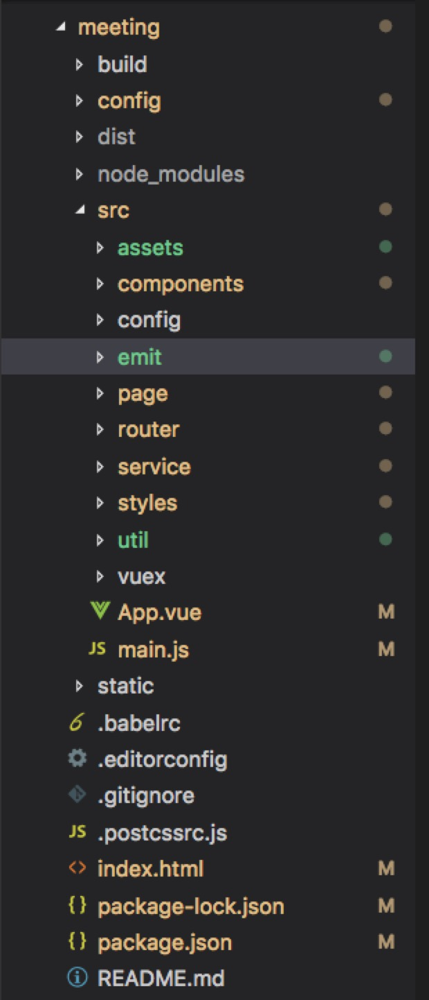

#### 什么是mvvm？

> MVVM是Model-View-ViewModel的缩写。mvvm是一种设计思想。Model 层代表数据模型，也可以在Model中定义数据修改和操作的业务逻辑；View 代表UI 组件，它负责将数据模型转化成UI 展现出来，ViewModel 是一个同步View 和 Model的对象。

在MVVM架构下，View 和 Model 之间并没有直接的联系，而是通过ViewModel进行交互，Model 和 ViewModel 之间的交互是双向的， 因此View 数据的变化会同步到Model中，而Model 数据的变化也会立即反应到View 上。  
ViewModel 通过双向数据绑定把 View 层和 Model 层连接了起来，而View和Model之间的同步工作完全是自动的，无需人为干涉，因此开发者只需关注业务逻辑，不需要手动操作DOM, 不需要关注数据状态的同步问题，复杂的数据状态维护完全由 MVVM 来统一管理。

#### mvvm和mvc区别？

> mvc和mvvm其实区别并不大。都是一种设计思想。主要就是mvc中Controller演变成mvvm中的viewModel。mvvm主要解决了mvc中大量的DOM操作使页面渲染性能降低，加载速度变慢，影响用户体验。和当Model频繁发生变化，开发者需要主动更新到View 。

#### vue的优点是什么？

低耦合。视图（View）可以独立于Model变化和修改，一个ViewModel可以绑定到不同的"View"上，当View变化的时候Model可以不变，当Model变化的时候View也可以不变。  
可重用性。你可以把一些视图逻辑放在一个ViewModel里面，让很多view重用这段视图逻辑。  
独立开发。开发人员可以专注于业务逻辑和数据的开发（ViewModel），设计人员可以专注于页面设计，使用Expression Blend可以很容易设计界面并生成xml代码。  
可测试。界面素来是比较难于测试的，而现在测试可以针对ViewModel来写。

#### 请详细说下你对vue生命周期的理解？

> 总共分为8个阶段创建前/后，载入前/后，更新前/后，销毁前/后。

创建前/后： 在beforeCreate阶段，vue实例的挂载元素el和数据对象data都为undefined，还未初始化。在created阶段，vue实例的数据对象data有了，el还没有。  
载入前/后：在beforeMount阶段，vue实例的$el和data都初始化了，但还是挂载之前为虚拟的dom节点，data.message还未替换。在mounted阶段，vue实例挂载完成，data.message成功渲染。  
更新前/后：当data变化时，会触发beforeUpdate和updated方法。  
销毁前/后：在执行destroy方法后，对data的改变不会再触发周期函数，说明此时vue实例已经解除了事件监听以及和dom的绑定，但是dom结构依然存在。

#### vue-cli 工程技术集合介绍

**构建的 vue-cli 工程都到了哪些技术，它们的作用分别是什么？**

1、vue.js：vue-cli工程的核心，主要特点是 双向数据绑定 和 组件系统。  
2、vue-router：vue官方推荐使用的路由框架。  
3、vuex：专为 Vue.js 应用项目开发的状态管理器，主要用于维护vue组件间共用的一些 变量 和 方法。  
4、axios（ 或者 fetch 、ajax ）：用于发起 GET 、或 POST 等 http请求，基于 Promise 设计。  
5、vux等：一个专为vue设计的移动端UI组件库。  
6、创建一个emit.js文件，用于vue事件机制的管理。  
7、webpack：模块加载和vue-cli工程打包器。

**vue-cli 工程常用的 npm 命令有哪些？**

下载 node_modules 资源包的命令：

	npm install 

启动 vue-cli 开发环境的 npm命令：

	npm run dev 

vue-cli 生成 生产环境部署资源 的 npm命令：

	npm run build 

用于查看 vue-cli 生产环境部署资源文件大小的 npm命令：

	npm run build --report

命令效果：


在浏览器上自动弹出一个 展示 vue-cli 工程打包后 app.js、manifest.js、vendor.js 文件里面所包含代码的页面。可以具此优化 vue-cli 生产环境部署的静态资源，提升 页面 的加载速度。

#### 组件之间的传值？

父组件与子组件传值

```html
	//父组件通过标签上面定义传值
	 <template>
	 	<Main :obj="data"></Main> 
	 </template>
	 <script> 
	 	//引入子组件     
	 	import Main form "./main"          
	 	exprot default{         
	 		name:"parent",         
	 		data(){             
	 			return {                 
	 				data:"我要向子组件传递数据"             
	 			}         
	 		},         
	 		//初始化组件         
	 		components:{             
	 			Main         
	 		}
	 	} 
	 </script> 

	 //子组件通过props方法接受数据 
	 <template>     
	 	<div>{{data}}</div> 
	 </template> 
	 <script>     
	 	exprot default{         
	 		name:"son",         //接受父组件传值         
	 		props:["data"]     
	 	} 
	 </script>
```

子组件向父组件传递数据

	 //子组件通过$emit方法传递参数 
	 <template>    
	 	<div v-on:click="events"></div> 
	 </template> 
	 <script>     
	 	//引入子组件     
	 	import Main form "./main"          
	 	exprot default{         
	 		methods:{             
	 			events:function(){   

	 			}         
	 		}     
	 	} 
	 </script> 


	 <template>
	 	<div>{{data}}</div> 
	 </template> 
	 <script>     
	 	exprot default{         
	 		name:"son",         //接受父组件传值         
	 		props:["data"]     
	 	} 
	 </script>


#### 路由模块

路由模块的本质 就是建立起url和页面之间的映射关系  
1、SPA的基本概念和工作原理  
SPA：single page application 单一页面应用程序，只有一个完整的页面；  
它在加载页面时，不会加载整个页面，而是只更新某个指定的容器中内容。比如Gmail、移动的webApp  
工作原理：

	1.解析地址栏 
	完整的页面地址、路由地址
	2.根据路由地址从路由词典中找到真正的要加载的页面
	3.发起ajax请求 
    请求要加载的页面4.像指定的容器中 插入加载来的页面

2、路由模块的基本使用  
1).引入vue.js vue-router.js  
2).指定一个容器router-view  
3).创建业务所需要用到的组件类  

	var MyLogin = Vue.component()
    
4.配置路由词典 

	const myRoutes = [
	  {path:'',component:MyLogin},
	  {path:'/login',component:MyLogin}
	 ]; const myRouter = new VueRouter({
	  routes:myRoutes
	 }) new Vue({
	   router:myRouter
	 })

5.测试  
修改地址栏中的路由地址，测试看加载的组件是否正确  
注意事项： 

	1.先引入vue，再引入插件 
	2.一定要指定router-view 
	3.route路由 {path:'',component:}

routes 路由数组 []  
router 路由器:按照指定的路由规则去访问对应的组件 new VueRouter

3、使用路由模块来实现页面跳转的方式  
声明式（标签跳转）

	<router-link :to="index">

编程式（ js跳转）

	router.push('index')

4、完成参数的传递  
在页面之间跳转的时候，在有些场景下，需要同时指定参数  
1.明确发送方和接收方

	list --20--> detail1.配置接收方的路由地址/detail --》 /detail/:indexthis.$route.params.index

2.发送

	routerLink to="/detail/20"this.$router.push('/detail/20')

5、路由嵌套  
在一个路由中，path对应一个component，如果这个component需要根据不同的url再加载其他的component，称之为路由的嵌套  
举例：比如A组件现在需要根据不同的url，加载B组件或者C组件1.给A组件指定一个容器  router-view

2.配置路由词典

  {
    path:'/a',
    component:A,
    children:[
      {path:'/b',component:B}
    ]
  }

需求：现在有两个组件，分别是login/mail,建立SPA。   
在此基础上，希望mail组件 嵌套inbox/outbox/draft  
补充：在设置子路由，路由匹配规则依然是适用的，只不过路由地址为空和异常，要携带父组件的路由地址/mail /mail/draft

#### 组件的使用和自己创建公用组件？

第一步：在components目录新建你的组件文件（indexPage.vue），script一定要export default {}  
第二步：在需要用的页面（组件）中导入：import indexPage from '@/components/indexPage.vue'  
第三步：注入到vue的子组件的components属性上面,components:{indexPage}  
第四步：在template视图view中使用，  
问题有indexPage命名，使用的时候则index-page。

#### vue如何实现按需加载配合webpack设置?

webpack中提供了require.ensure()来实现按需加载。  
以前引入路由是通过import 这样的方式引入，改为const定义的方式进行引入。   
不进行页面按需加载引入方式：

	import  home   from '../../common/home.vue' 

进行页面按需加载的引入方式：

	const  home = r => require.ensure( [], () => r (require('../../common/home.vue')))

#### vuex是什么？怎么使用？哪种功能场景使用它？

vue框架中状态管理。在main.js引入store，注入。新建了一个目录store，…export。场景有：单页应用中，组件之间的状态。音乐播放、登录状态、加入购物车

#### axios

1.axios的get方法

	export const getAjax = function (getUrl,getAjaxData) {  
		return axios.get(getUrl, {    
			params: {      
				'getAjaxDataObj1': getAjaxData.obj1,//obj1为getAjaxData的一个属性
	      		'getAjaxDataObj2': getAjaxData.obj2
	    	}
	  	})
	}

2.axios的post方法

	export const postAjax= function (getUrl,postAjaxData) {
		return axios.get(postUrl, {
			'postAjaxDataObj1': postAjaxData.obj1,//obj1为postAjaxData的一个属性
		  	'postAjaxDataObj2': postAjaxData.obj2
		 })
	}


3.axios的拦截器

主要分为请求和响应两种拦截器,请求拦截一般就是配置对应的请求头信息(适用与常见请求方法,虽然ajax的get方法没有请求头,但是axios里面进行啦封装),响应一般就是对reponse进行拦截处理,如果返回结果为[]可以转化为0  
1.请求拦截:将当前城市信息放入请求头中

	axios.interceptors.request.use(config => {
		config.headers.cityCode = window.sessionStorage.cityCode //jsCookie.get('cityCode')
		return config
	})

2.响应拦截:处理reponse的结果

	axios.interceptors.response.use((response) =>{  
		let data = response.data
	  	if(response.request.responseType === 'arraybuffer'&&!data.length){    
		 	reponse.date=0
		}
	})


#### vue-cli 工程目录结构介绍

**请说出vue-cli工程中每个文件夹和文件的用处**

注意：此问题千万不要只解释一下 src 文件夹下每个文件夹的作用。
vue-cli目录结构：



vue-cli目录解析：

1.build 文件夹：用于存放 webpack 相关配置和脚本。开发中仅 偶尔使用 到此文件夹下 webpack.base.conf.js 用于配置 less、sass等css预编译库，或者配置一下 UI 库。  
2.config 文件夹：主要存放配置文件，用于区分开发环境、线上环境的不同。 常用到此文件夹下 config.js 配置开发环境的 端口号、是否开启热加载 或者 设置生产环境的静态资源相对路径、是否开启gzip压缩、npm run build 命令打包生成静态资源的名称和路径等。  
3.dist 文件夹：默认 npm run build 命令打包生成的静态资源文件，用于生产部署。  
4.node_modules：存放npm命令下载的开发环境和生产环境的依赖包。  
5.src: 存放项目源码及需要引用的资源文件。

> src下assets：存放项目中需要用到的资源文件，css、js、images等。  
> src下componets：存放vue开发中一些公共组件：header.vue、footer.vue等。  
> src下emit：自己配置的vue集中式事件管理机制。  
> src下router：vue-router vue路由的配置文件。  
> src下service：自己配置的vue请求后台接口方法。  
> src下page：存在vue页面组件的文件夹。  
> src下util：存放vue开发过程中一些公共的.js方法。  
> src下vuex：存放 vuex 为vue专门开发的状态管理器。  
> src下app.vue：使用标签<route-view></router-view>渲染整个工程的.vue组件。  
> src下main.js：vue-cli工程的入口文件。

6.index.html：设置项目的一些meta头信息和提供app用于挂载 vue 节点。  
7.package.json：用于 node_modules资源部 和 启动、打包项目的 npm 命令管理。

**config文件夹 下 index.js 的对于工程 开发环境 和 生产环境 的配置**


build 对象下 对于 生产环境 的配置：

> index：配置打包后入口.html文件的名称以及文件夹名称  
> assetsRoot：配置打包后生成的文件名称和路径  
> assetsPublicPath：配置 打包后 .html 引用静态资源的路径，一般要设置成 "./"  
> productionGzip：是否开发 gzip 压缩，以提升加载速度


dev 对象下 对于 开发环境 的配置：

> port：设置端口号  
> autoOpenBrowser：启动工程时，自动打开浏览器  
> proxyTable：vue设置的代理，用以解决 跨域 问题

#### 请你详细介绍一些 package.json 里面的配置


常用对象解析：

> scripts：npm run xxx 命令调用node执行的 .js 文件  
> dependencies：生产环境依赖包的名称和版本号，即这些 依赖包 都会打包进 生产环境的JS文件里面  
> devDependencies：开发环境依赖包的名称和版本号，即这些 依赖包 只用于 代码开发 的时候，不会打包进 生产环境js文件 里面。

